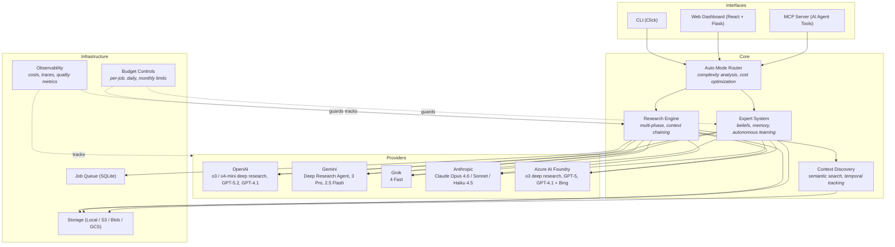

# Deepr

[](https://github.com/blisspixel/deepr/actions/workflows/ci.yml)
[](LICENSE)
[](https://www.python.org/downloads/)
[](ROADMAP.md)

**Research infrastructure, not another chat window.**

ChatGPT, Gemini, and Copilot each give you deep research from one vendor behind a chat UI. Deepr is the layer underneath — it routes across all of them, builds persistent expert agents that learn over time, and runs from scripts, cron jobs, and AI agent workflows. One report is easy. Scaling research, keeping experts current, and feeding knowledge into automated pipelines — that's what Deepr is for.

```bash
# Auto-routes to the best model per query: Grok ($0.01) → GPT-5.2 ($0.20) → o3 ($0.50)
deepr research "Will open-weight frontier models erode OpenAI/Anthropic enterprise margins by 2027?" --auto --budget 3 --explain

# Expert accumulates knowledge across sessions, fills its own gaps
# Slash commands, chat modes, visible reasoning, approval flows
deepr expert chat "AI Strategy Expert" --budget 3

# Batch 50 queries overnight — auto mode picks the right model for each
deepr research --auto --batch queries.txt --budget 10
```

Multi-provider (OpenAI, Gemini, Grok, Anthropic, Azure). Callable from AI agents via MCP. Reports and experts saved locally as artifacts you own.

**Stack:** Python · Flask · Click · React · TypeScript · Tailwind CSS · SQLite · WebSocket · Docker · AWS/Azure/GCP

<p align="center">
  
  
</p>

## Architecture



## Why Deepr?

**If you need one research report, use ChatGPT Deep Research, Google Gemini, or Microsoft Copilot.** They're easier — one click, 5-30 minutes, nice PDF. Already included in your $20/month subscription. For a single question, they're the right tool.

**Deepr is for when research is infrastructure, not a one-off.**

The single-vendor tools give you a report. Deepr gives you a research *system* — multi-provider, programmable, with persistent experts that accumulate knowledge over time and stay current. The difference matters when you're:

- **Scaling research** — Batch 50 queries overnight at $2, not clicking "Deep Research" 50 times. Auto-mode routes each query to the best model: simple lookups to Grok ($0.01), deep analysis to OpenAI ($0.50), reasoning to Claude, large context to Gemini. One interface, all providers.
- **Building persistent experts** — Not one-shot reports. Agents that accumulate knowledge across sessions, track beliefs with confidence, detect their own gaps, and autonomously research to fill them. An "AI Policy Expert" you seed today gets smarter every week.
- **Feeding AI workflows** — Your coding agents (Claude Code, Cursor, VS Code) call Deepr experts via MCP mid-task. They get living knowledge with citations, not hallucinations or stale training data. When the expert hits a gap, it researches autonomously within budget.
- **Running continuously** — Scripts, cron jobs, CI pipelines. Schedule competitive intel weekly. Monitor regulatory changes. Keep experts current. No browser, no manual clicking.
- **Auditing everything** — Every routing choice, source trust decision, stop condition, and cost is captured as a structured decision record. Not logs — queryable artifacts that feed back into routing and expert learning.
- **Avoiding lock-in** — Works with one API key, gets smarter with more. Reports and experts are local files you own. If OpenAI has an outage, auto-fallback routes to Gemini or Grok. No single vendor controls your research pipeline.

## Quick Start

```bash
pip install -e .                        # Install
cp .env.example .env                    # Add at least one API key
deepr doctor && deepr budget set 5      # Verify setup, set $5 budget
deepr research "Your question here"     # Run your first research job (~$1-2)
```

That's it. Results saved to `reports/` as markdown with citations. **You only need one API key to start** — OpenAI, Gemini, Grok, or Anthropic all work. Add more keys later and auto mode will route each query to the best available model.

Optional extras:

```bash
pip install -e ".[web]"                 # Web UI and MCP server
pip install -e ".[docs]"                # Document processing for experts
pip install -e ".[full]"                # All features
```

See [docs/QUICK_START.md](docs/QUICK_START.md) for a guided setup.

## Features

### Deep Research via CLI

Orchestrates deep research across OpenAI, Gemini, Grok, and Anthropic. Auto mode routes by complexity — simple lookups hit fast models at $0.01, hard questions hit deep research at $2. Reports saved locally as markdown with citations.

```bash
# AI + Strategy
deepr research "Are foundation model training runs approaching diminishing returns beyond 10T tokens?" --auto --explain
deepr research "How will AI copilots change junior software hiring over the next 5 years?" --auto --prefer-cost

# Hardware + Energy
deepr research "What bottlenecks could constrain NVIDIA Blackwell deployment at hyperscale in 2026?" --auto --full-trace
deepr research "Will grid-scale battery storage outcompete peaker plants in major US markets by 2030?" --auto --progress

# Biotech + Finance
deepr research "How will AI-driven drug discovery change pharma R&D timelines by 2030?" --budget 3 --explain
deepr research "How exposed are major banks to quantum decryption risk over the next 15 years?" --auto --timeline

# Batch + preview
deepr research --auto --batch queries.txt --dry-run          # Preview routing for 50 queries, no cost
```

See [docs/FEATURES.md](docs/FEATURES.md) for the full command reference including progress tracking, tracing, and observability.

### Domain Experts

Single-vendor tools give you a report and forget. Deepr experts persist.

**The problem:** Your best architect leaves. Their knowledge — scattered across Confluence, Slack threads, and their head — walks out the door. Or: AWS releases 47 new services this year. Your team can't keep up.

**Traditional RAG:** Upload docs → query → get answer. Static. Never learns. Never knows what it's missing.

**Deepr experts are different:**
- **Self-aware** — They recognize when they don't know something instead of hallucinating
- **Self-improving** — They can trigger research to fill their own knowledge gaps
- **Persistent** — New knowledge integrates permanently, not just for one session
- **Portable** — Export an expert and share it across your organization

```bash
# Create an expert with autonomous learning
deepr expert make "AI Policy Expert" -d "EU AI Act enforcement timeline 2026-2030" --learn --budget 5

# Chat with it — when it hits a gap, it researches autonomously
deepr expert chat "AI Policy Expert" --budget 3

# Proactively fill the highest-value knowledge gaps
deepr expert fill-gaps "Energy Transition Expert" --top 2 --budget 4

# Create from your own docs, runbooks, ADRs
deepr expert make "Platform Team Expert" --files docs/*.md confluence-export/*.html

# Export for the whole team
deepr expert export "AI Policy Expert" --output ./team-experts/
```

**Example:** You seed an "AI Policy Expert" with EU AI Act research. A colleague asks about US implications. The expert identifies a gap, researches it within budget, logs the decision, and integrates the findings permanently. Next time anyone asks, it knows.

See [docs/EXPERTS.md](docs/EXPERTS.md) for details.

### MCP + Skills (Research Infrastructure for AI Agents)

This is where Deepr becomes more than a CLI — it's **research infrastructure for AI agents**.

If you use Claude Code, Cursor, VS Code, or Zed, your AI agents can call Deepr as a tool via MCP. But with the included **skill** (`skills/deepr-research/`), agents learn *how* to use research intelligently:

**The workflow:**
```
You (in Cursor): "Draft a compliance checklist for our EU customers before the AI Act deadline"

Claude Code:
  1. Calls deepr_query_expert("AI Policy Expert", "AI Act compliance requirements for SaaS")
  2. Expert answers from accumulated knowledge with confidence scores and citations
  3. Expert flags a gap: "I lack detail on the August 2026 general-purpose AI provisions"
  4. Agent triggers deepr_agentic_research to fill the gap within budget
  5. Expert learns permanently — decision record logged with cost and rationale
  6. Claude continues with an accurate, cited compliance checklist
```

**What the skill teaches agents:**
- When to use quick search vs deep research vs expert consultation
- How to chain: Research → Plan → Query Expert → Fill Gaps → Continue
- Cost awareness (confirm before expensive operations)
- Resource subscriptions (70% token savings vs polling)
- Sandboxed execution (heavy research runs isolated, clean results returned)

**The result:** Your AI coding assistant can do real research mid-task — not just hallucinate or use stale training data. And the experts it consults get smarter over time.

16 MCP tools, resource subscriptions, prompt templates, budget elicitation. See [mcp/README.md](mcp/README.md) for setup.

### Web Dashboard

A local research management interface for when you want a visual view of your research operations. Built with React, TypeScript, and Tailwind CSS.

```bash
pip install -e ".[web]"
python deepr/web/app.py
# Open http://localhost:5000
```

**Pages:**
- **Overview** - Active jobs, recent activity feed, spending summary, system health
- **Research Studio** - Submit research with mode selection, model picker, drag-and-drop file upload, Ctrl+Enter submit
- **Research Live** - Real-time progress tracking via WebSocket push with background poller
- **Results Library** - Search, sort, and paginate completed research (12 per page)
- **Result Detail** - Full markdown report viewer with citation sidebar, copy-to-clipboard, export
- **Expert Hub** - List and manage domain experts, view knowledge gaps and stats
- **Expert Profile** - Agentic chat with experts via streaming WebSocket (slash commands, chat modes, visible reasoning, approval flows, context compaction), browse claims and knowledge gaps, review decisions, view learning history, manage skills
- **Cost Intelligence** - Spending trends, per-model breakdown, budget controls with charts
- **Models & Benchmarks** - Model registry browser, benchmark results with quality rankings, run benchmarks from UI
- **Trace Explorer** - Inspect research execution spans, timing, cost attribution
- **Help** - API key setup guide, CLI quick reference, model tier explanations
- **Settings** - Theme, budget limits, default model preferences, environment info, demo data loader

12 pages with code-split routing, skeleton loading states, Flask-SocketIO for real-time job push and streaming expert chat, and light/dark/system theme support. Built on Radix UI primitives (shadcn/ui pattern) with Recharts for data visualization.

**For team deployment**, the dashboard can be containerized and deployed to cloud infrastructure. See [deploy/README.md](deploy/README.md) for AWS, Azure, and GCP templates. Authentication and multi-user features are on the roadmap.

### Multi-Provider Support

**Start with one API key. Add more to unlock smarter routing.**

Deepr works with any single provider — but the more keys you configure, the better auto mode can optimize. With all providers available, simple lookups go to Grok at $0.01, deep research goes to OpenAI at $0.50, complex reasoning goes to Claude, and large-context analysis goes to Gemini. Auto-fallback on failures means no single provider outage stops your work.

| Provider | Key | Deep Research | Best For |
|----------|-----|---------------|----------|
| OpenAI | `OPENAI_API_KEY` | o3/o4-mini-deep-research | Comprehensive research, GPT-5.2/4.1 models |
| Gemini | `GEMINI_API_KEY` | Deep Research Agent | Large context (1M+), Google Search, cost-effective |
| Grok (xAI) | `XAI_API_KEY` | Via orchestration | Cheapest general tasks ($0.01), real-time web/news |
| Anthropic | `ANTHROPIC_API_KEY` | Extended Thinking | Complex reasoning, coding, transparent thinking |
| Azure AI Foundry | `AZURE_PROJECT_ENDPOINT` | o3-deep-research (Agents API) | Enterprise with Bing grounding, Azure compliance |

See [docs/MODELS.md](docs/MODELS.md) for the full model registry and pricing.

## Technical Highlights

Agent systems need more than prompts — they need infrastructure for running repeatedly, safely, and cheaply. Two design patterns run through Deepr:

- **Budgeted autonomy** — Every autonomous job runs under a contract: max spend, stop conditions, acceptable uncertainty, required citations, audit trail. This makes autonomous operation safe by default.
- **Decision records as artifacts** — The system captures *why* it chose a model, trusted a source, stopped searching, or flagged a knowledge gap. These aren't debug logs — they're queryable records that feed back into routing, expert learning, and cost optimization across runs.

Specific design decisions:

- **Local-first with SQLite, not Postgres.** Research results, expert profiles, job queues, and cost tracking all use SQLite. No database server to run, no connection strings to manage. Users `pip install` and go. Cloud deployment swaps in DynamoDB/CosmosDB/Firestore via storage abstractions, but the local experience stays zero-config.

- **Experts are not just RAG.** Most "chat with your docs" tools do retrieval → generation and stop there. Deepr experts have a metacognition layer — they track what they know (claims with confidence), recognize what they don't know (gaps with priority), and (in agentic mode) autonomously research to fill those gaps. The knowledge persists permanently, so the expert improves over time rather than resetting each session.

- **Auto-mode routing analyzes query complexity before choosing a model.** Simple factual questions go to grok-4-fast at $0.01. Complex multi-faceted research goes to o3-deep-research at $0.50. This isn't just keyword matching — it uses a lightweight classifier to estimate complexity, then factors in which API keys are configured, current budget, and provider health scores. Batch processing 20 queries this way costs $1-2 instead of $20-40.

- **Multi-layer budget controls because research costs real money.** Per-operation limits, daily caps, monthly ceilings, pre-submission estimates, and a circuit breaker that pauses after repeated failures. The system saves progress on pause so you can resume later. This was a hard requirement from day one — an uncapped loop calling o3-deep-research could burn $100+ before you notice.

- **Provider abstraction with circuit breakers, not just try/catch.** Each provider has health scoring with exponential decay, latency percentile tracking (p50/p95/p99), and automatic disabling after sustained failures. The router uses exploration/exploitation (10% exploration by default) to discover when a degraded provider recovers.

## What's Stable vs Experimental

**Production-ready:** Core research commands (`research`, `check`, `learn`), cost controls, expert creation/chat, context discovery (`deepr search`, `--context`), real-time progress tracking (`--progress`), temporal knowledge tracking, auto mode smart routing (`--auto`, `--batch`), OpenAI/Gemini/Grok/Anthropic providers, local SQLite storage. 3800+ tests.

**Experimental:** MCP server (works, but MCP spec is still maturing), web dashboard (12 pages, polished for local use with real-time WebSocket updates), agentic expert chat with slash commands, chat modes, visible reasoning, approval flows, expert council, and task planning (`--agentic`), expert skills system, auto-fallback circuit breakers, cloud deployment templates.

See [ROADMAP.md](ROADMAP.md) for detailed status.

## Cost Controls

Research costs real money ($1-$20 per run depending on depth). Deepr has multi-layer budget protection so you don't get surprised:

- Per-operation, daily, and monthly limits
- Pre-submission cost estimates
- Pause/resume at budget boundaries
- Cost tracking and anomaly detection
- **Auto mode** — Smart routing cuts costs 10-20x for simple queries

```bash
deepr budget set 5                                  # Set $5 limit
deepr cost estimate "Your prompt"                   # Estimate before running
deepr costs show                                    # See what you've spent
deepr costs timeline --days 14                      # Trends with anomaly detection
deepr research --auto --batch queries.txt --dry-run # Preview costs before executing
```

| Depth | Estimated Cost | Output |
|-------|---------------|--------|
| Auto mode (simple) | $0.01-$0.02 | Fast answer via grok-4-fast or gpt-4.1-mini |
| Auto mode (moderate) | $0.10 | o4-mini-deep-research |
| Auto mode (complex) | $0.50-$2.00 | o3-deep-research or Gemini Deep Research |
| Quick insight | $1-$2 | Focused summary with citations |
| Comprehensive | $2-$5 | Detailed structured report |
| Multi-phase | $5-$15 | Context-linked analysis |

**Tip:** Use `--auto` for batch operations. Process 20+ queries for $1-2 instead of $20-40. Start with `--dry-run` to preview routing decisions. Routing adapts to which API keys you have configured.

## Documentation

| Guide | Description |
|-------|-------------|
| [Quick Start](docs/QUICK_START.md) | Installation and first research job |
| [Features](docs/FEATURES.md) | Complete command reference |
| [Experts](docs/EXPERTS.md) | Domain expert system |
| [Models](docs/MODELS.md) | Provider comparison and model selection |
| [Benchmarks](docs/BENCHMARKS.md) | Model benchmarks, scoring methodology, and results |
| [Architecture](docs/ARCHITECTURE.md) | Technical architecture, security, budget protection |
| [Examples](docs/EXAMPLES.md) | Real-world usage examples |
| [MCP Integration](mcp/README.md) | MCP server setup and agent integration |
| [Deployment](deploy/README.md) | Cloud deployment (AWS, Azure, GCP) |
| [Changelog](docs/CHANGELOG.md) | Release history and migration notes |
| [Roadmap](ROADMAP.md) | Development priorities and future plans |

> **Note:** Model pricing changes frequently. Costs in this README are estimates as of February 2026. The [model registry](deepr/providers/registry.py) is the source of truth for current pricing.

## Requirements

- Python 3.9+
- **One API key** from any supported provider — that's all you need to start:
  - [OpenAI](https://platform.openai.com/api-keys) — deep research + GPT models
  - [Gemini](https://aistudio.google.com/app/apikey) — cost-effective, large context
  - [xAI Grok](https://console.x.ai/) — cheapest, real-time web search
  - [Anthropic](https://console.anthropic.com/settings/keys) — complex reasoning
- Optional: More API keys for smarter auto-routing across providers
- Optional: Node.js 18+ for web dashboard development

## Security

- Input validation and sanitization on all user inputs
- SSRF protection for web scraping operations
- API key redaction in logs and error messages
- Budget controls to prevent runaway costs
- Optional Docker isolation for untrusted workloads

3800+ unit tests. Pre-commit hooks run ruff (lint + format). See [Architecture](docs/ARCHITECTURE.md) for threat model and security implementation details.

**Report security vulnerabilities:** [nick@pueo.io](mailto:nick@pueo.io) (please do not open public issues for security bugs)

## Contributing

Contributions are welcome. High-impact areas:

- **Provider integrations** — New providers or improvements to existing ones
- **Cost optimization** — Better token estimation, caching strategies
- **Expert system** — Knowledge synthesis, gap detection algorithms
- **CLI UX** — Interactive mode, progress indicators, output formatting

Before submitting a PR:

1. Run `ruff check . && ruff format .` to lint and format
2. Run `pytest tests/` to verify tests pass
3. Add tests for new functionality

See [ROADMAP.md](ROADMAP.md) for planned work and priorities.

## License

[MIT License](LICENSE) — use freely, attribution appreciated.

---

## A Note on This Project

Deepr is an independent project by [Nick Seal](mailto:nick@pueo.io), maintained in spare time. It started as a weekend experiment with OpenAI's deep research API and grew into an exploration of how autonomous research systems should be built.

I believe automated research workflows will be one of the most impactful applications of AI over the next few years — for individuals, teams, and organizations. Building Deepr is also an exercise in a broader question: what does it take to run AI agents *continuously* — with budgets, reliability, memory, and auditability? The patterns here (economic governance, provider routing, persistent expertise, decision observability) are transferable well beyond research. At minimum, it's a way to learn the space deeply. At best, it's genuinely useful tooling for people who need research that goes beyond a chat window.

There's no SLA or commercial backing. If you find it useful, great. If you hit a rough edge, [open an issue](https://github.com/blisspixel/deepr/issues) or [start a discussion](https://github.com/blisspixel/deepr/discussions). Budget guardrails are well-tested (3800+ tests), but you're ultimately responsible for your own API keys and usage.

[GitHub](https://github.com/blisspixel/deepr) · [Issues](https://github.com/blisspixel/deepr/issues) · [Discussions](https://github.com/blisspixel/deepr/discussions)
