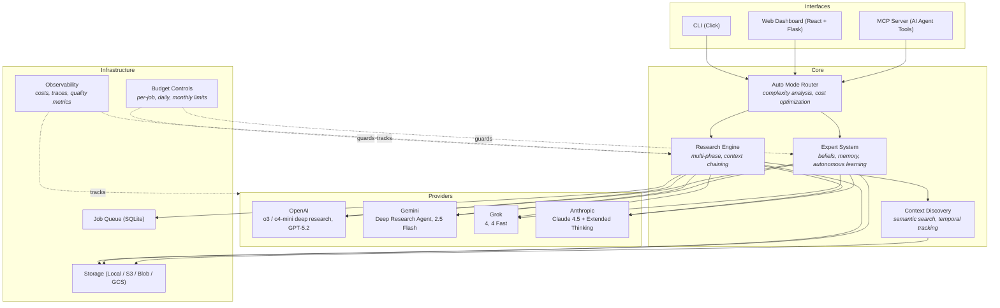

# Deepr

[](https://github.com/blisspixel/deepr/actions/workflows/ci.yml)
[](LICENSE)
[](https://www.python.org/downloads/)
[](ROADMAP.md)

**Deep research that produces experts, not just answers.**

Deepr produces two artifacts: **reports** (markdown with citations) and **experts**. Experts are persistent, versionable knowledge bases that track claims with confidence scores and detect their own gaps. They autonomously research to fill those gaps within budgeted limits. Every action — routing, source selection, stop conditions — is captured as a structured **decision record**, not a log line. Experts are queryable by other agents via MCP, so your AI workflows consume living knowledge instead of stale documents.

```bash
# Research produces a report — and feeds the expert
deepr research "Will open-weight frontier models erode OpenAI/Anthropic enterprise margins by 2027?" --auto --budget 3 --explain

# Expert accumulates knowledge across queries, fills its own gaps
deepr expert chat "AI Strategy Expert" --agentic --budget 3
```

Scriptable. Schedulable. Callable from your AI agents via MCP. Multi-provider (OpenAI, Gemini, Grok, Anthropic). Reports and experts saved locally as artifacts you own.

**Stack:** Python · Flask · Click · React · TypeScript · Tailwind CSS · SQLite · WebSocket · Docker · AWS/Azure/GCP


## Architecture



## Why Deepr?

Deepr wraps the same underlying APIs (OpenAI's o3/o4-mini-deep-research, Gemini's Deep Research Agent) and adds what they're missing:

- **Domain experts** — Persistent, versionable artifacts that accumulate knowledge, track beliefs with confidence, and autonomously research their own gaps. Not RAG — institutional memory that improves.
- **Decision records** — Every routing choice, source trust decision, stop condition, and gap fill is captured as a queryable record. Not logs. Auditable artifacts.
- **Budgeted autonomy** — Per-job budgets, daily limits, cost tracking. Experts act within constraints you set. Auto-mode routes simple queries to $0.01 models instead of $2 ones.
- **MCP integration** — Your AI agents (Claude Code, Cursor, VS Code, Zed) can query experts and trigger research mid-task. Living knowledge, not hallucinations.
- **Multi-provider** — Same interface across OpenAI, Gemini, Grok, and Anthropic. Auto-fallback on failures. Switch providers without changing code.
- **Automation** — Run from scripts, cron jobs, CI pipelines. No browser required. Schedule competitive intel weekly. Batch 50 queries overnight.
- **Local artifacts** — Reports and experts saved as files you own. No vendor lock-in.

## Quick Start

```bash
pip install -e .                        # Install
cp .env.example .env                    # Add OPENAI_API_KEY=sk-...
deepr doctor && deepr budget set 5      # Verify setup, set $5 budget
deepr research "Your question here"     # Run your first research job (~$1-2)
```

That's it. Results saved to `reports/` as markdown with citations.

Optional extras:

```bash
pip install -e ".[web]"                 # Web UI and MCP server
pip install -e ".[docs]"                # Document processing for experts
pip install -e ".[full]"                # All features
```

See [docs/QUICK_START.md](docs/QUICK_START.md) for a guided setup.

## Features

### Deep Research via CLI

Orchestrates deep research across OpenAI, Gemini, Grok, and Anthropic. Auto mode routes by complexity — simple lookups hit fast models at $0.01, hard questions hit deep research at $2. Reports saved locally as markdown with citations.

```bash
# AI + Strategy
deepr research "Are foundation model training runs approaching diminishing returns beyond 10T tokens?" --auto --explain
deepr research "How will AI copilots change junior software hiring over the next 5 years?" --auto --prefer-cost

# Hardware + Energy
deepr research "What bottlenecks could constrain NVIDIA Blackwell deployment at hyperscale in 2026?" --auto --full-trace
deepr research "Will grid-scale battery storage outcompete peaker plants in major US markets by 2030?" --auto --progress

# Biotech + Finance
deepr research "How will AI-driven drug discovery change pharma R&D timelines by 2030?" --budget 3 --explain
deepr research "How exposed are major banks to quantum decryption risk over the next 15 years?" --auto --timeline

# Batch + preview
deepr research --auto --batch queries.txt --dry-run          # Preview routing for 50 queries, no cost
```

See [docs/FEATURES.md](docs/FEATURES.md) for the full command reference including progress tracking, tracing, and observability.

### Domain Experts (The Interesting Part)

This is where Deepr goes beyond "ChatGPT but CLI."

**The problem:** Your best architect leaves. Their knowledge — scattered across Confluence, Slack threads, and their head — walks out the door. Or: AWS releases 47 new services this year. Your team can't keep up.

**Traditional RAG:** Upload docs → query → get answer. Static. Never learns. Never knows what it's missing.

**Deepr experts are different:**
- **Self-aware** — They recognize when they don't know something instead of hallucinating
- **Self-improving** — They can trigger research to fill their own knowledge gaps
- **Persistent** — New knowledge integrates permanently, not just for one session
- **Portable** — Export an expert and share it across your organization

```bash
# Create an expert seeded with a research question
deepr expert make "AI Policy Expert" --seed "EU AI Act enforcement timeline 2026-2030" --budget 5

# Chat with it — when it hits a gap, it researches autonomously
deepr expert chat "AI Policy Expert" "Will model eval transparency requirements affect US startups?" --agentic --budget 3

# Proactively fill the highest-value knowledge gaps
deepr expert fill-gaps "Energy Transition Expert" --top 2 --budget 4

# Create from your own docs, runbooks, ADRs
deepr expert make "Platform Team Expert" --files docs/*.md confluence-export/*.html

# Export for the whole team
deepr expert export "AI Policy Expert" --output ./team-experts/
```

**Example:** You seed an "AI Policy Expert" with EU AI Act research. A colleague asks about US implications. The expert identifies a gap, researches it within budget, logs the decision, and integrates the findings permanently. Next time anyone asks, it knows.

See [docs/EXPERTS.md](docs/EXPERTS.md) for details.

### MCP + Skills (Research Infrastructure for AI Agents)

This is where Deepr becomes more than a CLI — it's **research infrastructure for AI agents**.

If you use Claude Code, Cursor, VS Code, or Zed, your AI agents can call Deepr as a tool via MCP. But with the included **skill** (`skills/deepr-research/`), agents learn *how* to use research intelligently:

**The workflow:**
```
You (in Cursor): "Draft a compliance checklist for our EU customers before the AI Act deadline"

Claude Code:
  1. Calls deepr_query_expert("AI Policy Expert", "AI Act compliance requirements for SaaS")
  2. Expert answers from accumulated knowledge with confidence scores and citations
  3. Expert flags a gap: "I lack detail on the August 2026 general-purpose AI provisions"
  4. Agent triggers deepr_agentic_research to fill the gap within budget
  5. Expert learns permanently — decision record logged with cost and rationale
  6. Claude continues with an accurate, cited compliance checklist
```

**What the skill teaches agents:**
- When to use quick search vs deep research vs expert consultation
- How to chain: Research → Plan → Query Expert → Fill Gaps → Continue
- Cost awareness (confirm before expensive operations)
- Resource subscriptions (70% token savings vs polling)
- Sandboxed execution (heavy research runs isolated, clean results returned)

**The result:** Your AI coding assistant can do real research mid-task — not just hallucinate or use stale training data. And the experts it consults get smarter over time.

10 MCP tools, resource subscriptions, prompt templates, budget elicitation. See [mcp/README.md](mcp/README.md) for setup.

### Web Dashboard

A local research management interface for when you want a visual view of your research operations. Built with React, TypeScript, and Tailwind CSS.

```bash
pip install -e ".[web]"
python deepr/web/app.py
# Open http://localhost:5000
```

**Pages:**
- **Overview** - Active jobs, recent activity feed, spending summary, system health
- **Research Studio** - Submit research with mode selection, model picker, drag-and-drop file upload, Ctrl+Enter submit
- **Research Live** - Real-time progress tracking via WebSocket push with background poller
- **Results Library** - Search, sort, and paginate completed research (12 per page)
- **Result Detail** - Full markdown report viewer with citation sidebar, copy-to-clipboard, export
- **Expert Hub** - List and manage domain experts, view knowledge gaps and stats
- **Expert Profile** - Chat with experts, browse knowledge gaps, view learning history
- **Cost Intelligence** - Spending trends, per-model breakdown, budget controls with charts
- **Trace Explorer** - Inspect research execution spans, timing, cost attribution
- **Settings** - Theme, budget limits, default model preferences, environment info

The frontend uses code-split routing with skeleton loading states, Flask-SocketIO for real-time job push events, and light/dark/system theme support. Built on Radix UI primitives (shadcn/ui pattern) with Recharts for data visualization.

**For team deployment**, the dashboard can be containerized and deployed to cloud infrastructure. See [deploy/README.md](deploy/README.md) for AWS, Azure, and GCP templates. Authentication and multi-user features are on the roadmap.

### Multi-Provider Support

Works across OpenAI, Google Gemini, xAI Grok, Anthropic Claude, and Azure OpenAI. OpenAI and Gemini have native async deep research APIs; Anthropic uses Extended Thinking + tool orchestration. Deepr automatically routes tasks to the best model for the job and retries on failures.

| Provider | Deep Research | Best For |
|----------|---------------|----------|
| OpenAI | o3/o4-mini-deep-research | Comprehensive research |
| Gemini | Deep Research Agent | Large context, Google Search |
| Grok | Via orchestration | Cost-effective general tasks |
| Anthropic | Extended Thinking | Complex reasoning, coding |

## Technical Highlights

Agent systems need more than prompts — they need infrastructure for running repeatedly, safely, and cheaply. Two design patterns run through Deepr:

- **Budgeted autonomy** — Every autonomous job runs under a contract: max spend, stop conditions, acceptable uncertainty, required citations, audit trail. This makes autonomous operation safe by default.
- **Decision records as artifacts** — The system captures *why* it chose a model, trusted a source, stopped searching, or flagged a knowledge gap. These aren't debug logs — they're queryable records that feed back into routing, expert learning, and cost optimization across runs.

Specific design decisions:

- **Local-first with SQLite, not Postgres.** Research results, expert profiles, job queues, and cost tracking all use SQLite. No database server to run, no connection strings to manage. Users `pip install` and go. Cloud deployment swaps in DynamoDB/CosmosDB/Firestore via storage abstractions, but the local experience stays zero-config.

- **Experts are not just RAG.** Most "chat with your docs" tools do retrieval → generation and stop there. Deepr experts have a metacognition layer — they track what they know (claims with confidence), recognize what they don't know (gaps with priority), and (in agentic mode) autonomously research to fill those gaps. The knowledge persists permanently, so the expert improves over time rather than resetting each session.

- **Auto-mode routing analyzes query complexity before choosing a model.** Simple factual questions go to grok-4-fast at $0.01. Complex multi-faceted research goes to o3-deep-research at $0.50. This isn't just keyword matching — it uses a lightweight classifier to estimate complexity, then factors in which API keys are configured, current budget, and provider health scores. Batch processing 20 queries this way costs $1-2 instead of $20-40.

- **Multi-layer budget controls because research costs real money.** Per-operation limits, daily caps, monthly ceilings, pre-submission estimates, and a circuit breaker that pauses after repeated failures. The system saves progress on pause so you can resume later. This was a hard requirement from day one — an uncapped loop calling o3-deep-research could burn $100+ before you notice.

- **Provider abstraction with circuit breakers, not just try/catch.** Each provider has health scoring with exponential decay, latency percentile tracking (p50/p95/p99), and automatic disabling after sustained failures. The router uses exploration/exploitation (10% exploration by default) to discover when a degraded provider recovers.

## What's Stable vs Experimental

**Production-ready:** Core research commands (`research`, `check`, `learn`), cost controls, expert creation/chat, context discovery (`deepr search`, `--context`), real-time progress tracking (`--progress`), temporal knowledge tracking, auto mode smart routing (`--auto`, `--batch`), OpenAI and Gemini providers, local SQLite storage. 3600+ tests.

**Experimental:** MCP server (works, but MCP spec is still maturing), web dashboard (polished for local use with real-time WebSocket updates), agentic expert chat (`--agentic`), auto-fallback circuit breakers, cloud deployment templates.

See [ROADMAP.md](ROADMAP.md) for detailed status.

## Cost Controls

Research costs real money ($1-$20 per run depending on depth). Deepr has multi-layer budget protection so you don't get surprised:

- Per-operation, daily, and monthly limits
- Pre-submission cost estimates
- Pause/resume at budget boundaries
- Cost tracking and anomaly detection
- **Auto mode** — Smart routing cuts costs 10-20x for simple queries

```bash
deepr budget set 5                                  # Set $5 limit
deepr cost estimate "Your prompt"                   # Estimate before running
deepr costs show                                    # See what you've spent
deepr costs timeline --days 14                      # Trends with anomaly detection
deepr research --auto --batch queries.txt --dry-run # Preview costs before executing
```

| Depth | Estimated Cost | Output |
|-------|---------------|--------|
| Auto mode (simple) | $0.01-$0.02 | Fast answer via grok-4-fast or gpt-5.2 |
| Auto mode (moderate) | $0.10 | o4-mini-deep-research |
| Auto mode (complex) | $0.10-$0.50 | o4-mini or o3-deep-research |
| Quick insight | $1-$2 | Focused summary with citations |
| Comprehensive | $2-$5 | Detailed structured report |
| Multi-phase | $5-$15 | Context-linked analysis |

**Tip:** Use `--auto` for batch operations. Process 20+ queries for $1-2 instead of $20-40. Start with `--dry-run` to preview routing decisions. Routing adapts to which API keys you have configured.

## Documentation

| Guide | Description |
|-------|-------------|
| [Quick Start](docs/QUICK_START.md) | Installation and first research job |
| [Features](docs/FEATURES.md) | Complete command reference |
| [Experts](docs/EXPERTS.md) | Domain expert system |
| [Models](docs/MODELS.md) | Provider comparison and model selection |
| [Architecture](docs/ARCHITECTURE.md) | Technical architecture, security, budget protection |
| [Examples](docs/EXAMPLES.md) | Real-world usage examples |
| [MCP Integration](mcp/README.md) | MCP server setup and agent integration |
| [Deployment](deploy/README.md) | Cloud deployment (AWS, Azure, GCP) |
| [Changelog](docs/CHANGELOG.md) | Release history and migration notes |
| [Roadmap](ROADMAP.md) | Development priorities and future plans |

> **Note:** Model pricing changes frequently. Costs in this README are estimates as of February 2026. The [model registry](deepr/providers/registry.py) is the source of truth for current pricing.

## Requirements

- Python 3.9+
- API key for at least one provider (OpenAI, Gemini, Anthropic, Grok, or Azure)
- Optional: Node.js 18+ for web dashboard development

## Security

- Input validation and sanitization on all user inputs
- SSRF protection for web scraping operations
- API key redaction in logs and error messages
- Budget controls to prevent runaway costs
- Optional Docker isolation for untrusted workloads

3600+ unit tests. Pre-commit hooks run ruff (lint + format). See [Architecture](docs/ARCHITECTURE.md) for threat model and security implementation details.

**Report security vulnerabilities:** [nick@pueo.io](mailto:nick@pueo.io) (please do not open public issues for security bugs)

## Contributing

Contributions are welcome. High-impact areas:

- **Provider integrations** — New providers or improvements to existing ones
- **Cost optimization** — Better token estimation, caching strategies
- **Expert system** — Knowledge synthesis, gap detection algorithms
- **CLI UX** — Interactive mode, progress indicators, output formatting

Before submitting a PR:

1. Run `ruff check . && ruff format .` to lint and format
2. Run `pytest tests/` to verify tests pass
3. Add tests for new functionality

See [ROADMAP.md](ROADMAP.md) for planned work and priorities.

## License

[MIT License](LICENSE) — use freely, attribution appreciated.

---

## A Note on This Project

Deepr is an independent project by [Nick Seal](mailto:nick@pueo.io), maintained in spare time. It started as a weekend experiment with OpenAI's deep research API and grew into an exploration of how autonomous research systems should be built.

I believe automated research workflows will be one of the most impactful applications of AI over the next few years — for individuals, teams, and organizations. Building Deepr is also an exercise in a broader question: what does it take to run AI agents *continuously* — with budgets, reliability, memory, and auditability? The patterns here (economic governance, provider routing, persistent expertise, decision observability) are transferable well beyond research. At minimum, it's a way to learn the space deeply. At best, it's genuinely useful tooling for people who need research that goes beyond a chat window.

There's no SLA or commercial backing. If you find it useful, great. If you hit a rough edge, [open an issue](https://github.com/blisspixel/deepr/issues) or [start a discussion](https://github.com/blisspixel/deepr/discussions). Budget guardrails are well-tested (3600+ tests), but you're ultimately responsible for your own API keys and usage.

[GitHub](https://github.com/blisspixel/deepr) · [Issues](https://github.com/blisspixel/deepr/issues) · [Discussions](https://github.com/blisspixel/deepr/discussions)
