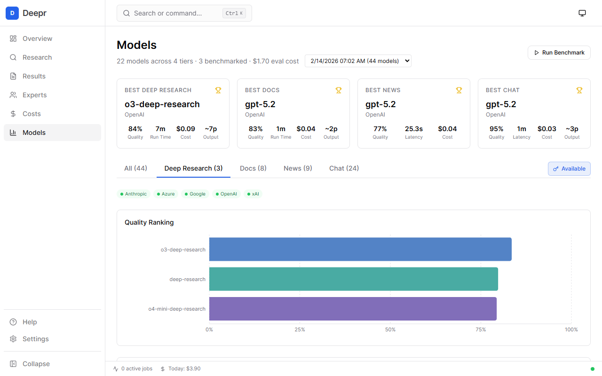

# Deepr

[](https://github.com/blisspixel/deepr/actions/workflows/ci.yml)
[](LICENSE)
[](https://www.python.org/downloads/)
[](ROADMAP.md)

**Research infrastructure, not another chat window.**

ChatGPT, Gemini, and Copilot each give you deep research from one vendor behind a chat UI. Deepr is the layer underneath — it routes across all of them, builds persistent expert agents that learn over time, and runs from scripts, cron jobs, and AI agent workflows. One report is easy. Scaling research, keeping experts current, and feeding knowledge into automated pipelines — that's what Deepr is for.

```bash
# Auto-routes to the best model per query: Grok ($0.01) → GPT-5.2 ($0.20) → o3 ($0.50)
deepr research "Will open-weight frontier models erode OpenAI/Anthropic enterprise margins by 2027?" --auto --budget 3

# Expert accumulates knowledge across sessions, fills its own gaps
deepr expert chat "AI Strategy Expert" --budget 3

# Batch 50 queries overnight — auto mode picks the right model for each
deepr research --auto --batch queries.txt --budget 10
```

Multi-provider (OpenAI, Gemini, Grok, Anthropic, Azure). Callable from AI agents via MCP. Reports and experts saved locally as artifacts you own.

<p align="center">
  
  
</p>

## Why Deepr?

**If you need one research report, use ChatGPT Deep Research or Gemini.** They're easier. For a single question, they're the right tool.

**Deepr is for when research is infrastructure, not a one-off:**

- **Scaling research** — Batch 50 queries at $2 instead of clicking "Deep Research" 50 times. Auto-mode routes each query to the cheapest model that can handle it.
- **Building persistent experts** — Agents that accumulate knowledge across sessions, track beliefs with confidence, detect their own gaps, and research to fill them.
- **Feeding AI workflows** — Your coding agents call Deepr experts via MCP mid-task. They get living knowledge with citations, not hallucinations or stale training data.
- **Running continuously** — Scripts, cron jobs, CI pipelines. No browser, no manual clicking.
- **Auditing everything** — Every routing choice, source trust decision, and cost is captured as a structured decision record.
- **Avoiding lock-in** — Reports and experts are local files you own. If one provider goes down, auto-fallback routes to another.

## Quick Start

```bash
pip install -e .                        # Install
cp .env.example .env                    # Add at least one API key
deepr doctor && deepr budget set 5      # Verify setup, set $5 budget
deepr research "Your question here"     # Run your first research job
```

Results saved to `reports/` as markdown with citations. **You only need one API key to start** — OpenAI, Gemini, Grok, or Anthropic all work. Add more keys later and auto mode will route each query to the best available model.

```bash
pip install -e ".[web]"                 # Web dashboard
pip install -e ".[full]"                # All features
```

See [docs/QUICK_START.md](docs/QUICK_START.md) for a guided setup.

## Features

### Research

Orchestrates deep research across providers. Auto mode routes by complexity — simple lookups at $0.01, deep analysis at $0.50-$2. Reports saved locally as markdown with citations.

```bash
deepr research "What bottlenecks could constrain NVIDIA Blackwell deployment at hyperscale?" --auto --explain
deepr research --auto --batch queries.txt --dry-run   # Preview routing, no cost
```

See [docs/FEATURES.md](docs/FEATURES.md) for the full command reference.

### Domain Experts

Deepr experts persist across sessions. They recognize knowledge gaps, research to fill them, and integrate findings permanently.

```bash
# Create an expert with autonomous learning
deepr expert make "AI Policy Expert" -d "EU AI Act enforcement timeline" --learn --budget 5

# Chat with it — slash commands, chat modes, visible reasoning, approval flows
deepr expert chat "AI Policy Expert" --budget 3

# Fill the highest-value knowledge gaps
deepr expert fill-gaps "Energy Transition Expert" --top 2 --budget 4

# Create from your own docs
deepr expert make "Platform Team Expert" --files docs/*.md
```

Agentic chat supports 27 slash commands (`/ask`, `/research`, `/advise`, `/focus`, `/council`, `/plan`, `/compact`, and more), visible reasoning, human-in-the-loop approval for expensive operations, multi-expert council, and hierarchical task decomposition.

See [docs/EXPERTS.md](docs/EXPERTS.md) for the full expert system guide.

### MCP Integration

Your AI agents (Claude Code, Cursor, VS Code) can call Deepr as a tool via MCP — query experts, trigger research, fill knowledge gaps, all mid-task with budget controls. 18 MCP tools, resource subscriptions, prompt templates. See [mcp/README.md](mcp/README.md) for setup.

### Web Dashboard

```bash
deepr web                # http://localhost:5000
```

12 pages: research submission, real-time progress, results library, expert chat with streaming and visible reasoning, cost analytics, model benchmarks, trace explorer, and more. Built with React, TypeScript, Tailwind CSS, and WebSocket push.

See [docs/FEATURES.md](docs/FEATURES.md) for the full page list.

### Multi-Provider Support

Start with one API key. Add more to unlock smarter routing. OpenAI, Gemini, Grok, Anthropic, and Azure AI Foundry all supported. Auto-fallback on failures means no single provider outage stops your work.

See [docs/MODELS.md](docs/MODELS.md) for provider comparison and pricing.

## Design

Two patterns run through Deepr:

- **Budgeted autonomy** — Every autonomous job runs under a contract: max spend, stop conditions, acceptable uncertainty, required citations, audit trail.
- **Decision records as artifacts** — The system captures *why* it chose a model, trusted a source, stopped searching, or flagged a knowledge gap. These feed back into routing, expert learning, and cost optimization.

See [docs/ARCHITECTURE.md](docs/ARCHITECTURE.md) for technical details.

## Cost Controls

Research costs real money. Deepr has multi-layer budget protection: per-operation limits, daily and monthly caps, pre-submission estimates, pause/resume at boundaries, and anomaly detection. Auto mode cuts costs 10-20x for simple queries by routing to cheaper models.

```bash
deepr budget set 5                                  # Set $5 limit
deepr costs show                                    # See what you've spent
deepr research --auto --batch queries.txt --dry-run # Preview costs before executing
```

See [docs/FEATURES.md](docs/FEATURES.md) for the full cost command reference.

## What's Stable vs Experimental

**Production-ready:** Core research commands, cost controls, expert creation/chat, context discovery, auto mode routing, all providers, local SQLite storage. 3800+ tests.

**Experimental:** Web dashboard, agentic expert chat (slash commands, modes, reasoning, approval, council, task planning), expert skills, MCP server, auto-fallback circuit breakers, cloud deployment templates.

See [ROADMAP.md](ROADMAP.md) for detailed status.

## Documentation

| Guide | Description |
|-------|-------------|
| [Quick Start](docs/QUICK_START.md) | Installation and first research job |
| [Features](docs/FEATURES.md) | Complete command reference |
| [Experts](docs/EXPERTS.md) | Domain expert system |
| [Models](docs/MODELS.md) | Provider comparison and model selection |
| [Architecture](docs/ARCHITECTURE.md) | Technical architecture, security, budget protection |
| [MCP Integration](mcp/README.md) | MCP server setup and agent integration |
| [Deployment](deploy/README.md) | Cloud deployment (AWS, Azure, GCP) |
| [Changelog](docs/CHANGELOG.md) | Release history |
| [Roadmap](ROADMAP.md) | Development priorities and future plans |

> **Note:** Model pricing changes frequently. The [model registry](deepr/providers/registry.py) is the source of truth for current pricing.

## Requirements

- Python 3.9+
- **One API key** from any supported provider:
  - [OpenAI](https://platform.openai.com/api-keys) — deep research + GPT models
  - [Gemini](https://aistudio.google.com/app/apikey) — cost-effective, large context
  - [xAI Grok](https://console.x.ai/) — cheapest, real-time web search
  - [Anthropic](https://console.anthropic.com/settings/keys) — complex reasoning
- Optional: More API keys for smarter auto-routing
- Optional: Node.js 18+ for web dashboard development

## Contributing

Contributions welcome. Run `ruff check . && ruff format .` and `pytest tests/` before submitting. See [ROADMAP.md](ROADMAP.md) for priorities.

## Security

3800+ tests. Pre-commit hooks run ruff. Input validation, SSRF protection, API key redaction, budget enforcement. See [Architecture](docs/ARCHITECTURE.md) for details.

**Report vulnerabilities:** [nick@pueo.io](mailto:nick@pueo.io) (not via public issues)

## License

[MIT License](LICENSE)

---

Deepr is an independent project by [Nick Seal](mailto:nick@pueo.io), maintained in spare time. It started as a weekend experiment with deep research APIs and grew into an exploration of how autonomous research systems should work — budgets, reliability, memory, auditability. The patterns here are transferable beyond research, but at minimum it's useful tooling for people who need research that goes beyond a chat window.

No SLA or commercial backing. If you find it useful, great. If you hit a rough edge, [open an issue](https://github.com/blisspixel/deepr/issues) or [start a discussion](https://github.com/blisspixel/deepr/discussions).

[GitHub](https://github.com/blisspixel/deepr) · [Issues](https://github.com/blisspixel/deepr/issues) · [Discussions](https://github.com/blisspixel/deepr/discussions)
