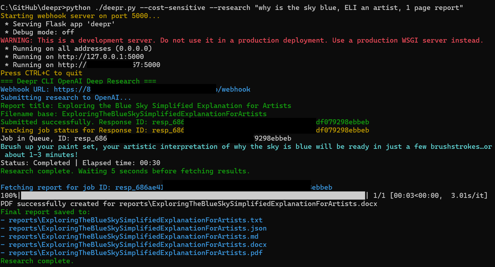

# Deepr
Deepr: Knowledge Is Power, Automate It: A modular research pipeline that automates complex research tasks, generating structured, citation-backed reports using OpenAI’s Deep Research API.

Deepr is an advanced, high-context command-line interface (CLI) research pipeline built on OpenAI’s Deep Research API, utilizing models such as o3-deep-research and o4-mini-deep-research. Deepr automates complex, multi-step research tasks, leveraging the power of the Deep Research API for deep synthesis, tool integration (such as web search), and structured output. It integrates asynchronous execution, webhook-based delivery, intelligent polling, and comprehensive lifecycle logging to provide research results in clean, professional formats—Markdown, Word (.docx), plain text, and JSON.

Research results are designed to meet the needs of various use cases, such as consulting, technical analysis, strategic briefs, and internal documentation.

## Purpose

Deepr accelerates the execution of complex research tasks in domains such as:

- **Competitive Intelligence**: Automating market research, competitor analysis, and product trends.
- **Regulatory Monitoring**: Keeping track of legal and regulatory changes across industries.
- **Technical Due Diligence**: Conducting deep dives into technical architectures, security practices, and compliance reports.
- **Narrative Framing and Policy Research**: Generating reports to shape policy decisions, strategic initiatives, and business narratives.

Its design focuses on automation, consistency, and scalability, enabling both ad hoc investigations and production-scale pipelines.



## Core Capabilities

### Model Selection

- **Full Synthesis**: Submit queries to o3-deep-research for thorough, detailed results.
- **Cost-Aware Execution**: Use o4-mini-deep-research for quicker, more cost-effective solutions when faster execution is needed.

### Web Search Integration

- **web_search_preview**: Automatically integrates live web search results, pulling real-time, high-quality content for research tasks.

### Code Interpreter Support

Supports structured analysis and chart generation unless disabled via the `--cost-sensitive` flag. Ideal for tasks that require computational analysis or visual data representation.

### Retry Mechanism

Deepr automatically retries job download attempts when the final report is not yet available, with increasing delays between retries. This ensures that reports are successfully downloaded, even if there are delays or issues.

If all retries fail, Deepr falls back to `manager.py`, which is known to reliably download reports, guaranteeing successful job completion retrieval.

### Prompt Refinement

GPT-4.1 is used in interactive mode to rewrite vague or unclear prompts, ensuring that the research query is focused and actionable. Skipped by default in `--research` or `--batch-file` modes unless overridden with `--raw`.

### Smart Title & Filename Generation

Automatically generates a clean report title and sanitized filename based on the content of the research query, ensuring that files are easy to manage and organized.

### Webhook Server

A Flask-based server receives asynchronous responses from the research models, while Ngrok provides a secure, public tunnel URL for job completion callbacks, allowing for real-time research results delivery.

### Multi-format Output

Deepr supports saving results in multiple formats:

- `.json` for structured data.
- `.md` for markdown-based reports.
- `.docx` for professionally styled Word documents.
- `.txt` for simple text outputs.

### Professional Word Styling

Word documents feature semantic formatting with headings, bullet points, and appropriate spacing, making them suitable for presentation to clients or executives.

### Job Logging

Deepr tracks research submissions and job statuses in `job_log.jsonl`, logging metadata such as timestamps, run IDs, and statuses, enabling easy tracking and auditing of all jobs.

### Clarification Handling

Deepr can optionally ask follow-up questions to clarify ambiguous inputs in interactive mode, ensuring the research task aligns with user expectations.

### Reference Handling

Use `--append-references` to include URLs extracted during the research in a separate section at the end of the report, keeping the main body clean and readable.

### Job Manager Integration

Deepr integrates with `manager.py` to allow job listing, inspection, cancellation, and retrieval of completed reports, providing full control over the research task lifecycle.

## Requirements

- Python 3.9+
- OpenAI API Key
- Ngrok installed and accessible in your system PATH
- Internet access (required for all model and web tool functionality)

## Install Dependencies

To install all necessary dependencies:
pip install openai flask python-dotenv colorama python-docx
To set up Ngrok, download the executable from ngrok.com/download and place it in a directory. Add this directory to your system's PATH. Verify installation by running ngrok version in the terminal.

## Setup

Clone the Repository:
git clone https://github.com/blisspixel/deepr.git
cd deepr
Create a .env File:
Add your OpenAI API Key to the .env file:

OPENAI_API_KEY=sk-...

Customize Tone and Output Style (Optional)
You can modify the default system message by editing system_message.json:
{
  "message": "You are a professional researcher writing clear, structured, data-informed reports. Do not include inline links or references in the main body. If necessary, summarize sources in a short appendix. Use a mix of paragraphs and bullet points where appropriate. Avoid em-dashes and emojis. Be direct, detailed, and concise—no fluff or filler."
}

## Usage
Start the CLI in Interactive Mode:
python deepr.py
Example Prompt:

Write a consulting-style report on the evolution of zero-trust architecture in enterprise cloud security.
The CLI will show the progress of the research job:

Status: In_Progress | Elapsed time: 02:10
Reports will be saved in the reports/ folder.

### Example: Researching Multiple Topics with One Command

You can automate research for multiple topics by using the batch mode with a text file (e.g., `queue.txt`). Each line in the file should be a separate research prompt.

**Example `queue.txt`:**
```
The impact of quantum computing on cybersecurity
Trends in sustainable urban development
```

Run batch research for all topics in the file:
```sh
python deepr.py --batch-file queue.txt
```

This will process each topic as a separate research job and save the results in the `reports/` folder.

> **Automation Tip:**
> You can build an AI agent or script to generate new research topics, append them to `queue.txt`, and then run the batch command above. This enables scalable, automated research pipelines for teams or individuals.

## Command-Line Options
Submit a One-Off Research Request: python deepr.py --research "Key trends in digital therapeutics market 2025"

Use a Cost-Sensitive Mode (Lighter Model, Fewer Tools): 

python deepr.py --cost-sensitive --research "Urban climate adaptation trends"

python deepr.py --output-title "AI Regulation Watchlist" --research "..."

Run Batch Research (One Prompt Per Line): python deepr.py --batch-file queue.txt

Append Extracted Links Under a "References" Section: python deepr.py --append-references --research "VC adaptation to AI-native startups"

Bypass Automatic Prompt Refinement: python deepr.py --raw --research "Explore sentiment trends in climate reporting"

Override the System Message: python deepr.py --briefing "You are a futurist creating speculative design insights."


## Output Format
Each completed research job will generate:

reports/

├── ExampleReportAbc123.json

├── ExampleReportAbc123.md

├── ExampleReportAbc123.docx

└── ExampleReportAbc123.txt

└── ExampleReportAbc123.pdf

Markdown and Word files include the report title as a top-level heading.

.docx output includes semantic styles (headings, bullets, spacing).

URLs are excluded from the main body unless --append-references is used.

Logs are saved to logs/job_log.jsonl.

Example Metadata Entry:
{
  "timestamp": "2025-07-04T17:10:23Z",
  "run_id": "f6e2e738",
  "response_id": "resp_abc123...",
  "prompt": "Research the effects of hybrid work on team collaboration dynamics",
  "status": "submitted"
}

## Job Management with manager.py
You can manage jobs using manager.py:
List active or recent jobs:
python manager.py --list
Download a report by ID:
python manager.py --download resp_abc123...
Cancel an in-flight job:
python manager.py --cancel resp_abc123...
Cancel all open jobs:
python manager.py --cancel-all

## Best Practices
Write clear prompts: Be specific, define your goals, and use full sentences.
Use --briefing to tailor the tone and analytical framing of the report.
Enable --append-references only when source links are needed.
Use --cost-sensitive for lightweight or exploratory tasks.
Use batch mode for scaling across many queries.
Let background jobs complete—reports will be saved even if the CLI session ends.

## Frequently Asked Questions
How is the webhook URL generated?
Ngrok runs locally. Deepr queries http://127.0.0.1:4040/api/tunnels to find the HTTPS tunnel for the webhook.

Can the model ask follow-up questions?
Yes—in interactive mode only. Clarification is skipped in scripted/batch runs.

How are filenames created?
GPT-4 generates a sanitized, filesystem-safe name based on the prompt content.

**How do I reduce API costs?**
Use --cost-sensitive to switch to a cheaper model and reduce tool usage.
Be Careful! You can spend $100 asking why the sky is blue with repeated queries.

Where do extracted links go?
They are excluded unless --append-references is enabled, in which case they appear in a footer section.
