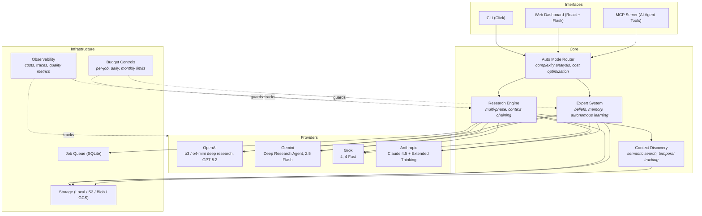

# Deepr

[](https://github.com/blisspixel/deepr/actions/workflows/ci.yml)
[](LICENSE)
[](https://www.python.org/downloads/)
[](ROADMAP.md)

**Deep research agents for automation — the same technology behind ChatGPT and Gemini, but scriptable.**

```bash
deepr research "What are the security implications of AWS Bedrock vs Azure OpenAI for enterprise RAG?"
```

ChatGPT and Gemini have powerful deep research, but it's trapped in a chat window. You can't script it, schedule it, or call it from your AI agents. Deepr fixes that.

**Stack:** Python · Flask · Click · React · TypeScript · Tailwind CSS · SQLite · WebSocket · Docker · AWS/Azure/GCP

## Architecture



## Why Deepr?

Deepr wraps the same underlying APIs (OpenAI's o3/o4-mini-deep-research, Gemini's Deep Research Agent) and adds what they're missing:

- **Automation** — Run from scripts, cron jobs, CI pipelines. No browser required. Schedule competitive intel weekly. Run 30 due diligence queries overnight.
- **Domain experts** — Build persistent experts from your docs that recognize knowledge gaps and research autonomously to fill them. Institutional knowledge that learns, improves, and doesn't quit.
- **MCP integration** — Your AI agents (Claude Code, Cursor, VS Code, Zed) can call deep research mid-task. Not hallucinations — actual research with citations.
- **Multi-provider** — Same interface across OpenAI, Gemini, Grok, and Anthropic. Auto-fallback on failures. Switch providers without changing code.
- **Cost controls** — Per-job budgets, daily limits, cost tracking. Auto-mode routes simple queries to $0.01 models instead of $2 ones.
- **Local storage** — Reports saved as markdown files you own. No vendor lock-in.

## Quick Start

```bash
pip install -e .                        # Install
cp .env.example .env                    # Add OPENAI_API_KEY=sk-...
deepr doctor && deepr budget set 5      # Verify setup, set $5 budget
deepr research "Your question here"     # Run your first research job (~$1-2)
```

That's it. Results saved to `reports/` as markdown with citations.

Optional extras:

```bash
pip install -e ".[web]"                 # Web UI and MCP server
pip install -e ".[docs]"                # Document processing for experts
pip install -e ".[full]"                # All features
```

See [docs/QUICK_START.md](docs/QUICK_START.md) for a guided setup.

## Features

### Deep Research via CLI

Submit research queries that use the same deep research agents as ChatGPT and Gemini. They search the web, synthesize sources, and produce structured reports with citations. Results saved locally as markdown.

```bash
deepr research "Kubernetes vs ECS Fargate for multi-tenant SaaS: tradeoffs"  # Deep research
deepr check "Does SOC 2 Type II require encryption at rest for all PII?"     # Compliance
deepr learn "Service mesh options for hybrid cloud" --phases 3               # Multi-phase
deepr team "Build internal ML platform or use SageMaker?"                    # Strategy

# Auto mode — routes by complexity (10-20x cost savings)
deepr research --auto "What is Python?"                      # → grok-4-fast ($0.01)
deepr research --auto "Analyze Tesla's competitive position" # → o3-deep-research ($0.50)
deepr research --auto --batch queries.txt --dry-run          # Preview routing for batch
```

See [docs/FEATURES.md](docs/FEATURES.md) for the full command reference including progress tracking, tracing, and observability.

### Domain Experts (The Interesting Part)

This is where Deepr goes beyond "ChatGPT but CLI."

**The problem:** Your best architect leaves. Their knowledge — scattered across Confluence, Slack threads, and their head — walks out the door. Or: AWS releases 47 new services this year. Your team can't keep up.

**Traditional RAG:** Upload docs → query → get answer. Static. Never learns. Never knows what it's missing.

**Deepr experts are different:**
- **Self-aware** — They recognize when they don't know something instead of hallucinating
- **Self-improving** — They can trigger research to fill their own knowledge gaps
- **Persistent** — New knowledge integrates permanently, not just for one session
- **Portable** — Export an expert and share it across your organization

```bash
# Create an expert from your architecture docs, runbooks, ADRs
deepr expert make "Platform Team Expert" --files docs/*.md confluence-export/*.html

# Chat with it — when it hits a knowledge gap, it researches
deepr expert chat "Platform Team Expert" --agentic --budget 5

# Proactively fill knowledge gaps (e.g., new AWS services)
deepr expert fill-gaps "Platform Team Expert" --budget 5 --top 3

# Preview what an expert would learn (no cost, no expert created)
deepr expert plan "Cloud Architecture" --budget 10

# Export for the whole team
deepr expert export "Platform Team Expert" --output ./team-experts/
```

**Example:** You create a "Cloud Architecture" expert from your internal docs. Someone asks about AWS Bedrock Guardrails (released last month). Instead of hallucinating, the expert says "I don't have information on that" and (in agentic mode) researches it, then integrates the findings permanently. Next time anyone asks, it knows.

This is institutional knowledge that learns, improves, and doesn't quit.

See [docs/EXPERTS.md](docs/EXPERTS.md) for details.

### MCP + Skills (Research Infrastructure for AI Agents)

This is where Deepr becomes more than a CLI — it's **research infrastructure for AI agents**.

If you use Claude Code, Cursor, VS Code, or Zed, your AI agents can call Deepr as a tool via MCP. But with the included **skill** (`skills/deepr-research/`), agents learn *how* to use research intelligently:

**The workflow:**
```
You (in Cursor): "Design a multi-region failover system for DynamoDB"

Claude Code:
  1. Realizes it needs current AWS documentation (not 2023 training data)
  2. Calls deepr_query_expert("Cloud Architecture Expert", "DynamoDB multi-region patterns")
  3. Expert identifies knowledge gap: "I don't have info on DynamoDB Global Tables v2"
  4. Agent triggers deepr_agentic_research to fill the gap
  5. Expert learns the new information permanently
  6. Claude continues with accurate, cited architecture recommendations
```

**What the skill teaches agents:**
- When to use quick search vs deep research vs expert consultation
- How to chain: Research → Plan → Query Expert → Fill Gaps → Continue
- Cost awareness (confirm before expensive operations)
- Resource subscriptions (70% token savings vs polling)
- Sandboxed execution (heavy research runs isolated, clean results returned)

**The result:** Your AI coding assistant can do real research mid-task — not just hallucinate or use stale training data. And the experts it consults get smarter over time.

10 MCP tools, resource subscriptions, prompt templates, budget elicitation. See [mcp/README.md](mcp/README.md) for setup.

### Web Dashboard

A local research management interface for when you want a visual view of your research operations. Built with React, TypeScript, and Tailwind CSS.

```bash
pip install -e ".[web]"
python -m deepr.web.app
# Open http://localhost:5000
```

**Pages:**
- **Overview** - Active jobs, recent activity feed, spending summary, system health
- **Research Studio** - Submit research with mode selection, model picker, and web search toggle
- **Research Live** - Real-time progress tracking for running jobs via WebSocket
- **Results Library** - Search, filter, and browse completed research with grid/list views
- **Result Detail** - Full markdown report viewer with citation sidebar and export options
- **Expert Hub** - List and manage domain experts, view knowledge gaps and stats
- **Expert Profile** - Chat with experts, browse knowledge gaps, view learning history
- **Cost Intelligence** - Spending trends, per-model breakdown, budget controls with charts
- **Trace Explorer** - Inspect research execution spans, timing, cost attribution
- **Settings** - Theme, API keys, budget limits, default model preferences

The frontend uses code-split routing for fast initial loads, WebSocket for real-time job updates, and light/dark/system theme support. The UI is built on Radix UI primitives with Recharts for data visualization.

**For team deployment**, the dashboard can be containerized and deployed to cloud infrastructure. See [deploy/README.md](deploy/README.md) for AWS, Azure, and GCP templates. Authentication and multi-user features are on the roadmap.

### Multi-Provider Support

Works across OpenAI, Google Gemini, xAI Grok, Anthropic Claude, and Azure OpenAI. OpenAI and Gemini have native async deep research APIs; Anthropic uses Extended Thinking + tool orchestration. Deepr automatically routes tasks to the best model for the job and retries on failures.

| Provider | Deep Research | Best For |
|----------|---------------|----------|
| OpenAI | o3/o4-mini-deep-research | Comprehensive research |
| Gemini | Deep Research Agent | Large context, Google Search |
| Grok | Via orchestration | Cost-effective general tasks |
| Anthropic | Extended Thinking | Complex reasoning, coding |

## Technical Highlights

A few design decisions that shaped the project:

- **Local-first with SQLite, not Postgres.** Research results, expert profiles, job queues, and cost tracking all use SQLite. No database server to run, no connection strings to manage. Users `pip install` and go. Cloud deployment swaps in DynamoDB/CosmosDB/Firestore via storage abstractions, but the local experience stays zero-config.

- **Experts are not just RAG.** Most "chat with your docs" tools do retrieval → generation and stop there. Deepr experts have a metacognition layer — they track what they know, recognize gaps, form beliefs with confidence levels, and (in agentic mode) autonomously research to fill those gaps. The knowledge persists permanently, so the expert improves over time rather than resetting each session.

- **Auto-mode routing analyzes query complexity before choosing a model.** Simple factual questions go to grok-4-fast at $0.01. Complex multi-faceted research goes to o3-deep-research at $0.50. This isn't just keyword matching — it uses a lightweight classifier to estimate complexity, then factors in which API keys are configured, current budget, and provider health scores. Batch processing 20 queries this way costs $1-2 instead of $20-40.

- **Multi-layer budget controls because research costs real money.** Per-operation limits, daily caps, monthly ceilings, pre-submission estimates, and a circuit breaker that pauses after repeated failures. The system saves progress on pause so you can resume later. This was a hard requirement from day one — an uncapped loop calling o3-deep-research could burn $100+ before you notice.

- **Provider abstraction with circuit breakers, not just try/catch.** Each provider has health scoring with exponential decay, latency percentile tracking (p50/p95/p99), and automatic disabling after sustained failures. The router uses exploration/exploitation (10% exploration by default) to discover when a degraded provider recovers.

## What's Stable vs Experimental

**Production-ready:** Core research commands (`research`, `check`, `learn`), cost controls, expert creation/chat, context discovery (`deepr search`, `--context`), real-time progress tracking (`--progress`), temporal knowledge tracking, auto mode smart routing (`--auto`, `--batch`), OpenAI and Gemini providers, local SQLite storage. 3600+ tests.

**Experimental:** MCP server (works, but MCP spec is still maturing), web dashboard (functional for local use, recently overhauled), agentic expert chat (`--agentic`), auto-fallback circuit breakers, cloud deployment templates.

See [ROADMAP.md](ROADMAP.md) for detailed status.

## Cost Controls

Research costs real money ($1-$20 per run depending on depth). Deepr has multi-layer budget protection so you don't get surprised:

- Per-operation, daily, and monthly limits
- Pre-submission cost estimates
- Pause/resume at budget boundaries
- Cost tracking and anomaly detection
- **Auto mode** — Smart routing cuts costs 10-20x for simple queries

```bash
deepr budget set 5                                  # Set $5 limit
deepr cost estimate "Your prompt"                   # Estimate before running
deepr costs show                                    # See what you've spent
deepr costs timeline --days 14                      # Trends with anomaly detection
deepr research --auto --batch queries.txt --dry-run # Preview costs before executing
```

| Depth | Estimated Cost | Output |
|-------|---------------|--------|
| Auto mode (simple) | $0.01-$0.02 | Fast answer via grok-4-fast or gpt-5.2 |
| Auto mode (moderate) | $0.10 | o4-mini-deep-research |
| Auto mode (complex) | $0.10-$0.50 | o4-mini or o3-deep-research |
| Quick insight | $1-$2 | Focused summary with citations |
| Comprehensive | $2-$5 | Detailed structured report |
| Multi-phase | $5-$15 | Context-linked analysis |

**Tip:** Use `--auto` for batch operations. Process 20+ queries for $1-2 instead of $20-40. Start with `--dry-run` to preview routing decisions. Routing adapts to which API keys you have configured.

## Documentation

| Guide | Description |
|-------|-------------|
| [Quick Start](docs/QUICK_START.md) | Installation and first research job |
| [Features](docs/FEATURES.md) | Complete command reference |
| [Experts](docs/EXPERTS.md) | Domain expert system |
| [Models](docs/MODELS.md) | Provider comparison and model selection |
| [Architecture](docs/ARCHITECTURE.md) | Technical architecture, security, budget protection |
| [Examples](docs/EXAMPLES.md) | Real-world usage examples |
| [MCP Integration](mcp/README.md) | MCP server setup and agent integration |
| [Deployment](deploy/README.md) | Cloud deployment (AWS, Azure, GCP) |
| [Changelog](docs/CHANGELOG.md) | Release history and migration notes |
| [Roadmap](ROADMAP.md) | Development priorities and future plans |

> **Note:** Model pricing changes frequently. Costs in this README are estimates as of February 2026. The [model registry](deepr/providers/registry.py) is the source of truth for current pricing.

## Requirements

- Python 3.9+
- API key for at least one provider (OpenAI, Gemini, Anthropic, Grok, or Azure)
- Optional: Node.js 18+ for web dashboard development

## Security

- Input validation and sanitization on all user inputs
- SSRF protection for web scraping operations
- API key redaction in logs and error messages
- Budget controls to prevent runaway costs
- Optional Docker isolation for untrusted workloads

3600+ unit tests. Pre-commit hooks run ruff (lint + format). See [Architecture](docs/ARCHITECTURE.md) for threat model and security implementation details.

**Report security vulnerabilities:** [nick@pueo.io](mailto:nick@pueo.io) (please do not open public issues for security bugs)

## Contributing

Contributions are welcome. High-impact areas:

- **Provider integrations** — New providers or improvements to existing ones
- **Cost optimization** — Better token estimation, caching strategies
- **Expert system** — Knowledge synthesis, gap detection algorithms
- **CLI UX** — Interactive mode, progress indicators, output formatting

Before submitting a PR:

1. Run `ruff check . && ruff format .` to lint and format
2. Run `pytest tests/` to verify tests pass
3. Add tests for new functionality

See [ROADMAP.md](ROADMAP.md) for planned work and priorities.

## License

[MIT License](LICENSE) — use freely, attribution appreciated.

---

## A Note on This Project

Deepr is a nights-and-weekends passion project by [Nick Seal](mailto:nick@pueo.io). It started as a weekend experiment with OpenAI's deep research API and grew from there.

I believe automated research workflows will be one of the most impactful applications of AI over the next few years — for individuals, teams, and organizations. At minimum, building Deepr is a way to learn the space deeply and explore what's possible. At best, it's genuinely useful tooling for people who need research that goes beyond a chat window.

This is not a commercial product. There's no company behind it, no SLA, and no guarantees. It's maintained in my spare time because I find the problem space fascinating. If you find it useful, that's great. If you hit a rough edge, [open an issue](https://github.com/blisspixel/deepr/issues) or [start a discussion](https://github.com/blisspixel/deepr/discussions) — I'm happy to help when I can.

Use at your own risk, especially around cost controls and API spending. The budget guardrails are well-tested (3600+ tests), but you're ultimately responsible for your own API keys and usage.

[GitHub](https://github.com/blisspixel/deepr) · [Issues](https://github.com/blisspixel/deepr/issues) · [Discussions](https://github.com/blisspixel/deepr/discussions)
