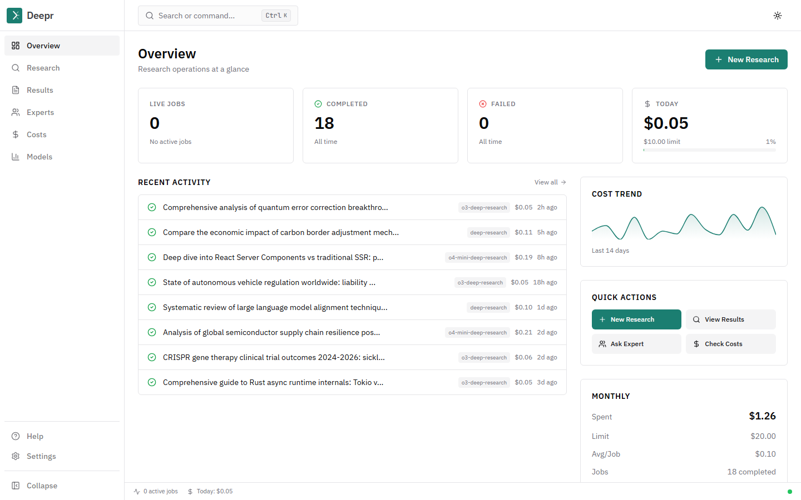
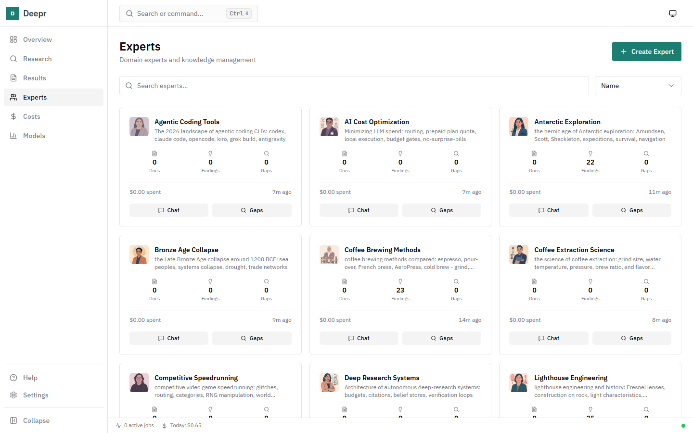
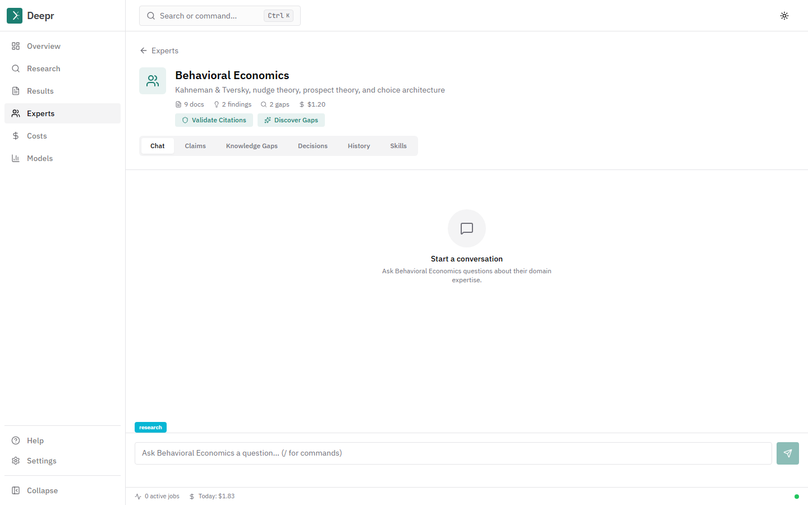
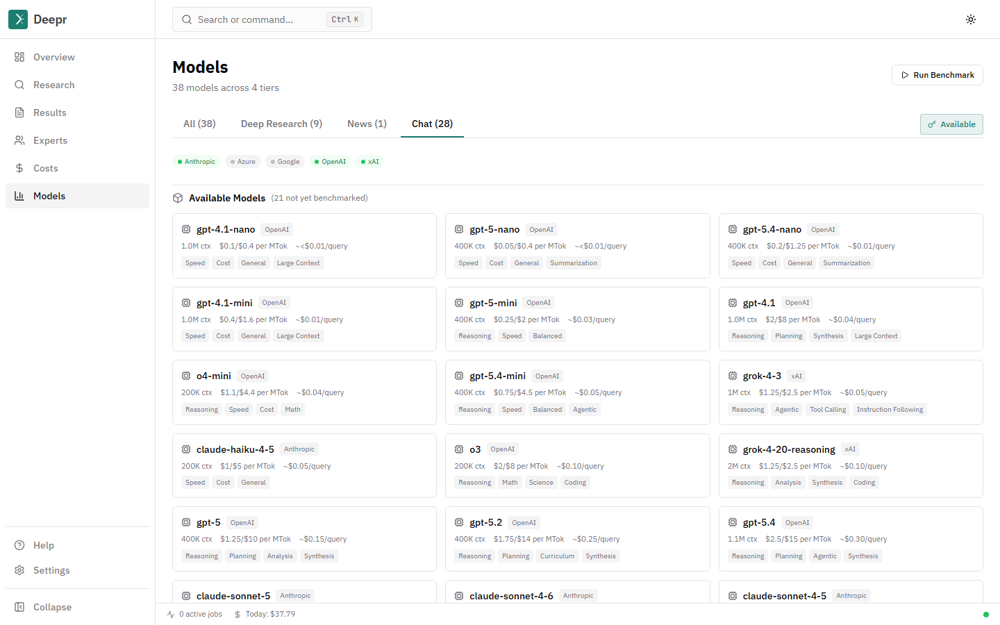

# Deepr

[](https://github.com/blisspixel/deepr/actions/workflows/ci.yml)
[](LICENSE)
[](https://www.python.org/downloads/)
[](https://github.com/blisspixel/deepr/releases/tag/v2.16.2)

**Domain experts, not another chat window.**

In plain terms: you bring your own AI accounts (OpenAI, Gemini, Grok, Anthropic - any one is enough), and Deepr routes each research question to the cheapest model that can handle it, then builds experts that remember what they learned.

ChatGPT, Gemini, and Copilot each give you deep research from one vendor behind a chat UI. Deepr is the layer underneath - it routes across all of them and builds persistent expert agents that learn over time. Each expert is a named role ("AI Strategy Expert", "Security Specialist", "Fabric Architect") that accumulates domain knowledge, tracks its own gaps, and can be consulted by humans or other agents alike. Deepr runs from scripts, cron jobs, and AI agent workflows - so your experts are always available as team members, not just tools you invoke manually.

```bash
# Auto-routes to the best model per query: Grok 4.1 Fast ($0.01) -> GPT-5.4 -> o3-deep-research
# (--budget is a ceiling, not a price: most queries cost far less than the cap)
deepr research "Will open-weight frontier models erode OpenAI/Anthropic enterprise margins by 2027?" --auto --budget 3

# Expert accumulates knowledge across sessions, fills its own gaps
deepr expert chat "AI Strategy Expert" --budget 3

# Batch 50 queries overnight - auto mode picks the right model for each
deepr research --auto --batch queries.txt --budget 10
```

Multi-provider (OpenAI, Gemini, Grok, Anthropic, Azure). Callable from AI agents via MCP. Reports and experts saved locally as artifacts you own.

<p align="center">
  
  
</p>
<p align="center">
  
  
</p>

## Why Deepr?

**If you need one research report, use ChatGPT Deep Research or Gemini.** They're easier. For a single question, they're the right tool.

**Who Deepr is for:** analysts and research teams who batch dozens of queries; developers building agents that need grounded, citable knowledge mid-task; anyone running research on a schedule instead of in a chat window. You should be comfortable with a terminal - or use the web dashboard once it's set up. If you ask ChatGPT one question a day on your phone, Deepr is more tool than you need.

**Deepr is for when research is infrastructure, not a one-off:**

- **Scaling research** - Batch 50 queries at $2 instead of clicking "Deep Research" 50 times. Auto-mode routes each query to the cheapest model that can handle it.
- **Building persistent experts** - Agents that accumulate knowledge across sessions, track beliefs with confidence, detect their own gaps, and research to fill them.
- **Feeding AI workflows** - Your coding agents call Deepr experts via MCP mid-task. They get living knowledge with citations, not hallucinations or stale training data.
- **Grounding always-on agents** - The autopilot platforms (Microsoft Autopilots, OpenAI Workspace Agents, Google Antigravity, AWS AgentCore) run agents for months, but their memory is shallow session state. An always-on agent has exactly the problem Deepr experts solve: it needs durable, verified, current domain knowledge with provenance, and a cheap way to re-sync with what changed since it last asked.
- **Composing into agent teams** - Experts expose structured outputs with handoff-ready artifacts. An upstream signal agent can feed findings into a Deepr expert, which produces research that a downstream strategy or proposal agent consumes. Deepr doesn't orchestrate the team - it plays a role on it.
- **Running continuously** - Scripts, cron jobs, CI pipelines. No browser, no manual clicking.
- **Auditing everything** - Every routing choice, source trust decision, and cost is captured as a structured decision record.
- **Avoiding lock-in** - Reports and experts are local files you own. If one provider goes down, auto-fallback routes to another. If a better tool comes along, your experts move with you.

**Where this is headed, honestly:** the ideas here - persistent experts, budget-bounded autonomy, routing across providers - may well get absorbed into the big platforms over time, and that's fine. The part that stays yours either way is the knowledge: experts are local files you own, portable across tools rather than tied to one vendor's memory. And as subscription plans and local models keep improving, the plan (see the [roadmap](ROADMAP.md) capacity release) is to route more of the work onto capacity you already pay for or own, so keeping a roster of experts current costs close to nothing extra. Deepr is one person's working answer to how those pieces should fit together - if part of it is useful to you, take it.

## Quick Start

**One-line install**

**Windows (PowerShell):**
```powershell
powershell -ExecutionPolicy ByPass -c "irm https://raw.githubusercontent.com/blisspixel/deepr/main/scripts/install.ps1 | iex"
```

**macOS / Linux:**
```bash
curl -fsSL https://raw.githubusercontent.com/blisspixel/deepr/main/scripts/install.sh | bash
```

After the installer finishes, open a **new** terminal and run `deepr init` (guided setup: detects your keys, writes `.env`, sets a budget ceiling), then `deepr doctor` to verify.

**Updating:** run `deepr upgrade` (or `deepr upgrade --check` to just see if a newer version exists). Re-running the install one-liner above also updates an existing install. To remove it, re-run the one-liner with `-Uninstall` (Windows) or `-- --uninstall` (macOS/Linux).

---

**Deepr runs on Windows, macOS, and Linux** (Python 3.12+). It works with one or more of OpenAI, Gemini, Grok, or Anthropic (any single key is enough to start).

### Install from source

If you are not using the one-line installer above, install from a clone. Pick
the path that matches what you want to do.

> **Where to run install:** `git clone` creates a `deepr/` directory with
> `pyproject.toml` at its root - `cd deepr` and run install commands from
> there. The package source lives under `src/deepr/` (src layout); you do not
> `cd` into it. (If you cloned into a folder you also named `deepr`, your shell
> path will read `deepr/deepr` - that outer level is just your clone location,
> not part of the project.)

**Just use `deepr` (recommended): a global command via pipx.**

```bash
# from the repo root (the deepr/ directory you cloned)
pipx install -e .
# or, once released:  pipx install deepr-research
```

`pipx` puts `deepr` on your PATH so it works in any terminal with no
activation, and `-e` tracks your local changes. If `pipx` is missing, run the
one-line installer above once - it installs pipx for you.

**Develop and run the test suite: a virtual environment.**

```bash
python -m venv .venv
# Windows (PowerShell):  .\.venv\Scripts\Activate.ps1
# Windows (cmd):         .venv\Scripts\activate.bat
# macOS / Linux:         source .venv/bin/activate
pip install -e ".[dev,full]"   # dev tooling + all extras
```

> With a venv, `deepr` only works while the venv is **activated**. If you see
> `deepr: not recognized` (Windows) or `command not found` (macOS/Linux),
> either activate the venv (commands above) or use the `pipx` install instead.

**Then, however you installed:**

```bash
deepr init                 # guided setup: detects keys, writes .env, sets a budget ceiling
deepr doctor               # verify connectivity
deepr research "Your question here"
```

Results saved to `data/reports/` as markdown with citations. **You only need one API key to start**. Add more later and auto-mode routes to the best/cheapest model per task.

See [docs/QUICK_START.md](docs/QUICK_START.md) and [docs/INSTALL.md](docs/INSTALL.md) for guided setup, Windows notes, and extras.

## Features

### Research

Orchestrates deep research across providers. Auto mode routes by complexity - simple lookups at $0.01, deep analysis at $0.50-$2. Reports saved locally as markdown with citations.

```bash
deepr research "What bottlenecks could constrain NVIDIA Blackwell deployment at hyperscale?" --auto --explain
deepr research --auto --batch queries.txt --dry-run   # Preview routing, no cost
```

See [docs/FEATURES.md](docs/FEATURES.md) for the full command reference.

### Domain Experts

Deepr experts persist across sessions. They recognize knowledge gaps, research to fill them, and integrate findings permanently.

```bash
# Create an expert with autonomous learning
deepr expert make "AI Policy Expert" -d "EU AI Act enforcement timeline" --learn --budget 5

# Chat with it - slash commands, chat modes, visible reasoning, approval flows
deepr expert chat "AI Policy Expert" --budget 3

# Fill the highest-value knowledge gaps
deepr expert fill-gaps "Energy Transition Expert" --top 2 --budget 4

# Create from your own docs
deepr expert make "Platform Team Expert" --files docs/*.md
```

Agentic chat supports 27 slash commands (`/ask`, `/research`, `/advise`, `/focus`, `/council`, `/plan`, `/compact`, and more), visible reasoning, human-in-the-loop approval for expensive operations, multi-expert council, and hierarchical task decomposition.

See [docs/EXPERTS.md](docs/EXPERTS.md) for the full expert system guide.

### MCP Integration - Experts as Consultable Roles

Your AI agents (Claude Code, Cursor, VS Code) can call Deepr experts via MCP - not as a generic "research tool" but as named domain roles. An agent working on a proposal can consult "AI Strategy Expert" for market context, then hand that context to a downstream agent for solution design. 26 MCP tools, resource subscriptions, prompt templates, budget propagation, and trace ID stitching across agent boundaries. See [mcp/README.md](mcp/README.md) for setup.

This matters most for the new generation of always-on agents: an agent that runs for months needs durable, verified, current domain knowledge with provenance - and a cheap way to re-sync ("what changed since I last consulted you?") instead of re-reading everything. Deepr experts are that knowledge layer; the host platform keeps the schedule, Deepr keeps the perspective.

### Web Dashboard

```bash
deepr web                # http://localhost:5000
```

12 pages: research submission, real-time progress, results library, expert chat with streaming and visible reasoning, cost analytics, model benchmarks, trace explorer, and more. Built with React, TypeScript, Tailwind CSS, and WebSocket push.

See [docs/FEATURES.md](docs/FEATURES.md) for the full page list.

### Benchmarking and Evals

Deepr includes a cost-safe benchmark workflow for keeping routing current as models change.

```bash
# Evaluate only new/missing model+tier combinations (default $1 preflight cap)
deepr eval new

# Estimate first, no spend
deepr eval new --dry-run --tier all

# Intentionally allow larger spend when needed
deepr eval new --max-estimated-cost 3
```

The dashboard reads `data/benchmarks/routing_preferences.json` and shows per-task best quality and best value picks.

### Setup and Capacity

`deepr init` is a guided, non-interactive-friendly setup: it detects existing API keys, writes `.env`, sets a budget ceiling, and can point your data at a synced folder. `deepr doctor` verifies connectivity and storage, with a severity-ranked next step. `deepr capacity` shows what you can actually run with - owned/prepaid capacity first (local Ollama, plan-based CLIs), metered APIs last - and summarizes any locally observed plan-quota state from the append-only quota ledger.

```bash
deepr init --yes --budget 5 --data-dir ~/OneDrive/deepr   # scripted setup, portable data
deepr doctor                                               # connectivity + storage health
deepr capacity --probe                                     # what's available, incl. local models
```

Local-model execution runs quality-tolerant steps (extraction, sync, draft synthesis) at $0 against a local Ollama endpoint:

```bash
deepr expert absorb "Platform Team Expert" report.md --local
deepr expert sync "Platform Team Expert" --local
```

See [docs/design/capacity-waterfall.md](docs/design/capacity-waterfall.md) for the capacity model and routing direction.

### Evidence and Calibration

Two evals make trust measurable instead of asserted. `deepr eval continuity` scores an expert's staleness honesty, abstention, contradiction-surfacing, and what-changed exactness from stored state at $0. `deepr eval calibrate` answers "does extraction confidence track actual grounding?" with a reliability curve, expected calibration error, and a Platt-derived threshold - `--from` grades existing pairs at $0, `--corpus` runs the paid extraction and pre-grade.

```bash
deepr eval continuity "AI Policy Expert"
deepr eval calibrate --from data/calibration/graded.jsonl   # $0
deepr eval calibrate --corpus tests/data/calibration --max-cost 3 --yes
```

See [docs/CALIBRATION.md](docs/CALIBRATION.md) for the first measured curve and [docs/design/checks-deterministic-vs-agentic.md](docs/design/checks-deterministic-vs-agentic.md) for what belongs in deterministic code versus model judgment.

### Multi-Provider Support

Start with one API key. Add more to unlock smarter routing. OpenAI, Gemini, Grok, Anthropic, and Azure AI Foundry all supported. Auto-fallback on failures means no single provider outage stops your work.

See [docs/MODELS.md](docs/MODELS.md) for provider comparison and pricing.

## Design

Three patterns run through Deepr:

- **Budgeted autonomy** - Every autonomous job runs under a contract: max spend, stop conditions, acceptable uncertainty, required citations, audit trail.
- **Decision records as artifacts** - The system captures *why* it chose a model, trusted a source, stopped searching, or flagged a knowledge gap. These feed back into routing, expert learning, and cost optimization.
- **Experts as roles, not tools** - Each expert is a persistent, named role with its own knowledge state, beliefs, and gaps. You don't "run Deepr" - you consult a domain expert. This makes experts composable: they can receive structured input from upstream agents, produce handoff-ready artifacts for downstream agents, and participate in multi-agent workflows without being the orchestrator. Think of each as a tailored second brain (note the plural): instead of one generic vault you organize by hand, you get a roster of domain-scoped knowledge bases that stay current on their topics, verify what they ingest, and deploy as an agent team.

See [docs/ARCHITECTURE.md](docs/ARCHITECTURE.md) for technical details.

## Cost Controls

Research costs real money. Deepr has multi-layer budget protection: per-operation limits, daily and monthly caps, pre-submission estimates, pause/resume at boundaries, anomaly detection, and a canonical append-only cost ledger (`data/costs/cost_ledger.jsonl`).

```bash
deepr budget set 5                                  # Set $5 limit
deepr costs show                                    # See what you've spent
deepr costs doctor                                 # Validate tracker health + drift (no API spend)
deepr research --auto --batch queries.txt --dry-run # Preview costs before executing
```

Set `DEEPR_COST_TRACKING_STRICT=1` to fail fast when cost events cannot be persisted to the canonical ledger.

**Gemini large-context pricing note:** Gemini 3.1 Pro (the default Gemini pro model) charges 2x for prompts over 200K tokens ($4/$18 per 1M input/output vs $2/$12 under 200K). Most queries stay well under that threshold, but large document analysis (`--files` with big PDFs, 500+ page corpora) can cost ~2x more than shorter prompts - e.g., a 250K-token document analysis runs ~$1.18 vs ~$0.62 for a sub-200K prompt. Use `--dry-run` to preview costs before executing, and `--budget` to cap spend.

See [docs/FEATURES.md](docs/FEATURES.md) for the full cost command reference.

## Startup Banner

Deepr shows an animated startup banner by default in interactive terminals, with automatic fallbacks for CI, screen readers, no-color terminals, and low-capability terminals.

```bash
deepr interactive --banner     # Force-show banner once
deepr interactive --no-banner  # Skip banner
```

Optional env controls:
- `DEEPR_BANNER_MODE=off|static|light|full`
- `DEEPR_BANNER_DURATION=<seconds>` (applies to animated modes)
- `DEEPR_ANIMATIONS=off|light|full`
- `DEEPR_BRANDING=off|on|auto`

## What's Stable vs Experimental

**Production-ready:** Core research commands, cost controls, expert creation/chat, context discovery, auto mode routing, all providers, local SQLite storage, guided setup (`deepr init`/`deepr doctor`), and a portable data directory (one `DEEPR_DATA_DIR` relocates experts and research, so they follow you across machines via OneDrive/Dropbox/etc.). 5700+ tests (Python 3.12-3.14).

**Experimental:** Web dashboard, agentic expert chat (slash commands, modes, reasoning, approval, council, task planning), expert skills, MCP server, auto-fallback circuit breakers, cloud deployment templates, capacity visibility + local-model execution (`deepr capacity`, `--local` on expert sync/absorb), and the evidence layer (`deepr eval continuity`, `deepr eval calibrate`).

See [ROADMAP.md](ROADMAP.md) for detailed status.

## Documentation

| Guide | Description |
|-------|-------------|
| [Quick Start](docs/QUICK_START.md) | Installation and first research job |
| [Features](docs/FEATURES.md) | Complete command reference |
| [Experts](docs/EXPERTS.md) | Domain expert system |
| [Models](docs/MODELS.md) | Provider comparison and model selection |
| [Architecture](docs/ARCHITECTURE.md) | Technical architecture, security, budget protection |
| [MCP Integration](mcp/README.md) | MCP server setup and agent integration |
| [Integrations](docs/INTEGRATIONS.md) | First-party tool integrations (recon, distillr, primr) |
| [Agentic Vision](docs/AGENTIC_VISION.md) | Agentic architecture, A2A, reflection, campaigns |
| [Deployment](deploy/README.md) | Cloud deployment (AWS, Azure, GCP) |
| [Changelog](docs/CHANGELOG.md) | Release history |
| [Roadmap](ROADMAP.md) | Development priorities and future plans |

> **Note:** Model pricing changes frequently. The [model registry](src/deepr/providers/registry.py) is the source of truth for current pricing.

## Requirements

- Python 3.12+ (tested on 3.12-3.14)
- **One API key** from any supported provider:
  - [OpenAI](https://platform.openai.com/api-keys) - deep research + GPT models
  - [Gemini](https://aistudio.google.com/app/apikey) - cost-effective, large context
  - [xAI Grok](https://console.x.ai/) - Grok 4.20 flagship + 4.1 Fast budget, real-time web search
  - [Anthropic](https://console.anthropic.com/settings/keys) - complex reasoning
- Optional: More API keys for smarter auto-routing
- Optional: Node.js 18+ for web dashboard development

## Contributing

Contributions welcome. Run `ruff check . && ruff format .` and `pytest` before submitting. See [ROADMAP.md](ROADMAP.md) for priorities.

## Security

5700+ tests (Python 3.12-3.14). Pre-commit hooks run ruff; CI also runs mypy (kernel is `--strict`) and pip-audit. Input validation, prompt-injection sanitization, SSRF protection, API key redaction, budget enforcement. See [Architecture](docs/ARCHITECTURE.md) for details.

**Report vulnerabilities:** [nick@pueo.io](mailto:nick@pueo.io) (not via public issues)

## License

[MIT License](LICENSE)

---

Deepr is an independent project by [Nick Seal](mailto:nick@pueo.io), maintained in spare time. It started as a weekend experiment with deep research APIs and grew into an exploration of how autonomous research systems should work - budgets, reliability, memory, auditability. The patterns here are transferable beyond research, but at minimum it's useful tooling for people who need research that goes beyond a chat window.

No SLA or commercial backing. If you find it useful, great. If you hit a rough edge, [open an issue](https://github.com/blisspixel/deepr/issues) or [start a discussion](https://github.com/blisspixel/deepr/discussions).

[GitHub](https://github.com/blisspixel/deepr) · [Issues](https://github.com/blisspixel/deepr/issues) · [Discussions](https://github.com/blisspixel/deepr/discussions)
