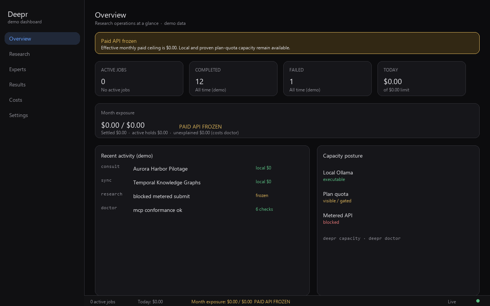

# Deepr

[](https://github.com/blisspixel/deepr/actions/workflows/ci.yml)
[](LICENSE)
[](https://www.python.org/downloads/)
[](https://github.com/blisspixel/deepr/releases/tag/v2.46.0)

**Persistent domain experts built from bounded, auditable research.**

Deepr turns research into durable beliefs, gaps, contradictions, confidence,
citations, provenance, and outcomes. It prefers owned local models, then proven
subscription quota, with no automatic fallback to a paid API.

<p align="center">
  
</p>

<p align="center">
  <em>Demo CLI session only (fictional expert and spend). Not a live account or real research content. Regenerated with <code>python scripts/render_cli_demo_screenshot.py</code>.</em>
</p>

<p align="center">
  
  
</p>

<p align="center">
  <em>The optional web UI, captured from a real run against the local expert
  fleet. Spend figures are a local sandbox and no metered work is dispatched.
  Regenerated with <code>node src/deepr/web/frontend/screenshot-qa.mjs</code>
  against <code>deepr web</code>.</em>
</p>

## Capacity

| Class | Current posture |
| --- | --- |
| Local Ollama | Preferred for expert setup, maintenance, evaluation, and consultation after endpoint ownership is proven. |
| Prepaid plan quota | Runs only when authentication, tool confinement, remaining quota, and disabled paid overage are proven. Claude Code is the current executable adapter. |
| Metered API | No automatic fallback. Production dispatch is currently blocked pending a provider-authenticated account-control adapter. |

A budget is a hard ceiling, not permission to spend. Metered work requires a
durable reservation, a final pre-dispatch check, append-only settlement, and a
live provider control bound to the exact account, credential, client, and
request. Unknown state blocks. Paid dispatch is currently frozen.

```bash
deepr budget set 5
deepr costs show
deepr costs doctor
```

See [Capacity and Cost](docs/CAPACITY.md) for billing reconciliation and the
complete no-surprise-spend contract.

## Install

Windows PowerShell:

```powershell
powershell -ExecutionPolicy ByPass -c "irm https://raw.githubusercontent.com/blisspixel/deepr/main/scripts/install.ps1 | iex"
```

Linux and macOS:

```bash
curl -fsSL https://raw.githubusercontent.com/blisspixel/deepr/main/scripts/install.sh | bash
```

Installers use the latest verified GitHub Release wheel in an isolated pipx
environment. PyPI publication is not enabled.

## Quick start

```bash
deepr init
deepr doctor --skip-connectivity
deepr capacity
deepr expert make "My Domain Expert" --local -d "The decisions this expert supports"
deepr expert consult "What should we decide next?" --expert "My Domain Expert" --local
```

See [Quick Start](docs/QUICK_START.md), [Supported Surface](docs/SUPPORTED_SURFACE.md),
and the [MCP Agent Guide](docs/MCP_AGENT_TEST_GUIDE.md) for workflows across the
current 36 MCP tools. The MCP server implements the final `2026-07-28`
protocol revision (stateless per-request negotiation, `server/discover`,
`subscriptions/listen`, Streamable HTTP header and Origin validation) while
still serving legacy `initialize`-era clients on both transports. Operators can
prove the offline host-interop posture with `deepr mcp conformance` (`$0`, no
network, no model).

## Documentation

- [Approach contract](docs/APPROACH.md) - what the method claims, refuses, and leaves experimental
- [Supported Surface](docs/SUPPORTED_SURFACE.md) - what currently runs
- [Experts](docs/EXPERTS.md)
- [Architecture](docs/ARCHITECTURE.md)
- [Models](docs/MODELS.md)
- [Threat Model](docs/security/THREAT_MODEL.md)
- [Roadmap](ROADMAP.md)
- [Changelog](docs/CHANGELOG.md)
- [Contributing](CONTRIBUTING.md)

## Development

```bash
uv pip install -e ".[dev,full]"
pytest tests/unit/ --ignore=tests/data -q
ruff check src/deepr/
ruff format --check src/deepr/
python scripts/check_file_sizes.py
python scripts/check_ratchets.py
python scripts/check_paid_api_boundaries.py
```

Do not run bare `pytest`: integration tests can contact real providers. The
blocking unit suite requires at least 80 percent branch coverage.

## License

[Apache 2.0](LICENSE)
