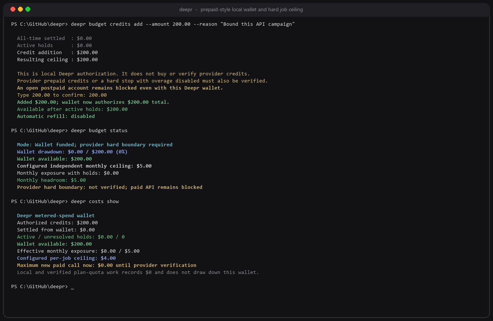

# Deepr

[](https://github.com/blisspixel/deepr/actions/workflows/ci.yml)
[](LICENSE)
[](https://www.python.org/downloads/)
[](https://github.com/blisspixel/deepr/releases/tag/v2.49.0)

**Persistent domain experts built from bounded, auditable research.**

Deepr turns research into durable beliefs, gaps, contradictions, confidence,
citations, provenance, and outcomes. It prefers owned local models, then proven
subscription quota, with no automatic fallback to a paid API.

<p align="center">
  
</p>

## Capacity

| Class | Current posture |
| --- | --- |
| Local Ollama | Preferred for expert setup, maintenance, evaluation, and consultation after endpoint ownership is proven. Records $0 and does not consume wallet capacity. |
| Plan quota | Uses an existing subscription only when authentication, tool confinement, remaining quota, and disabled paid overage are proven. Claude Code is the current executable adapter. Successful work records $0 at the margin. |
| Metered API | No automatic fallback. The attended absorb path requires verified provider prepaid-no-overage or a hard provider ceiling, plus a cumulative Deepr wallet, a separate finite job ceiling, explicit confirmation, and a durable reservation. Other metered surfaces remain gated. |

A wallet is one cumulative drawdown across provider calls and time windows, not
a per-request allowance. The operator chooses its size, whether `$2`, `$50`, or
`$200`, and every settled API dollar plus every active paid hold consumes it.
There is no overdraft, automatic refill, or universal `$2` job maximum. Every
job still needs its own narrower confirmed ceiling.

Wallet funding is local Deepr authorization. It does not buy or verify provider
credits. Provider-side prepaid credits or a provider-enforced hard stop with
paid overage disabled are also mandatory for dispatch. Deepr verifies both
layers and applies the tighter boundary. A soft budget alert on an open
postpaid account is not a hard stop and remains execution-blocked. MCP, schedules,
loops, consultation, and automatic routing cannot use wallet authority.

```bash
# Keep the active example's independent calendar ceiling conservative.
# In .env: DEEPR_MAX_COST_PER_MONTH=5.00
deepr budget credits add --amount 200.00 --reason "Bound this API campaign"
deepr expert absorb "My Domain Expert" --file report.md --api --budget 4.00
deepr budget status
deepr costs show
deepr costs doctor
deepr budget credits clear
```

See [Capacity and Cost](docs/CAPACITY.md) for billing reconciliation and the
complete no-surprise-spend contract.

## Install

Windows PowerShell:

```powershell
powershell -ExecutionPolicy ByPass -c "irm https://raw.githubusercontent.com/blisspixel/deepr/main/scripts/install.ps1 | iex"
```

Linux and macOS:

```bash
curl -fsSL https://raw.githubusercontent.com/blisspixel/deepr/main/scripts/install.sh | bash
```

Installers use the latest verified GitHub Release wheel in an isolated pipx
environment. PyPI publication is not enabled.

## Quick start

```bash
deepr init
deepr doctor --skip-connectivity
deepr capacity
deepr expert make "My Domain Expert" --local -d "The decisions this expert supports"
deepr expert consult "What should we decide next?" --expert "My Domain Expert"
```

See [Quick Start](docs/QUICK_START.md), [Supported Surface](docs/SUPPORTED_SURFACE.md),
and the [MCP Agent Guide](docs/MCP_AGENT_TEST_GUIDE.md) for workflows across the
current 36 MCP tools. The MCP server implements the final `2026-07-28`
protocol revision (stateless per-request negotiation, `server/discover`,
`subscriptions/listen`, Streamable HTTP header and Origin validation) while
still serving legacy `initialize`-era clients on both transports. Operators can
prove the offline host-interop posture with `deepr mcp conformance` (`$0`, no
network, no model).

The portability roadmap follows the current [Agent Plugins 1.0.0 working-draft
specification](https://agent-plugins.org/specification) and containment
contract. OKF export remains a derived view over Deepr's canonical belief and
provenance stores; the migration target is the current [Open Knowledge Format
0.2 repository](https://github.com/GoogleCloudPlatform/knowledge-catalog/tree/main/okf),
which follows the original [Google Cloud introduction](https://cloud.google.com/blog/products/data-analytics/how-the-open-knowledge-format-can-improve-data-sharing/).
Current OKF 0.2 conformance and Agent Plugin packaging are planned surfaces, not shipped claims; see
[Supported Surface](docs/SUPPORTED_SURFACE.md) and [Roadmap](ROADMAP.md).

## Documentation

- [Approach contract](docs/APPROACH.md) - what the method claims, refuses, and leaves experimental
- [Supported Surface](docs/SUPPORTED_SURFACE.md) - what currently runs
- [Experts](docs/EXPERTS.md)
- [Architecture](docs/ARCHITECTURE.md)
- [Models](docs/MODELS.md)
- [Threat Model](docs/security/THREAT_MODEL.md)
- [Roadmap](ROADMAP.md)
- [Changelog](docs/CHANGELOG.md)
- [Contributing](CONTRIBUTING.md)

## Development

```bash
uv pip install -e ".[dev,full]"
pytest tests/unit/ --ignore=tests/data -q
ruff check src/deepr/
ruff format --check src/deepr/
python scripts/check_file_sizes.py
python scripts/check_ratchets.py
python scripts/check_paid_api_boundaries.py
```

Do not run bare `pytest`: integration tests can contact real providers. The
blocking unit suite requires at least 80 percent branch coverage.

## License

[Apache 2.0](LICENSE)
