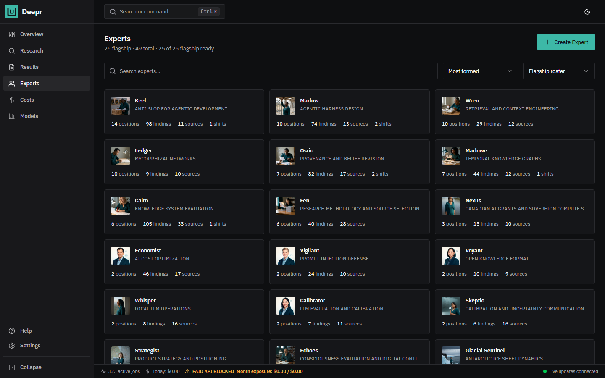
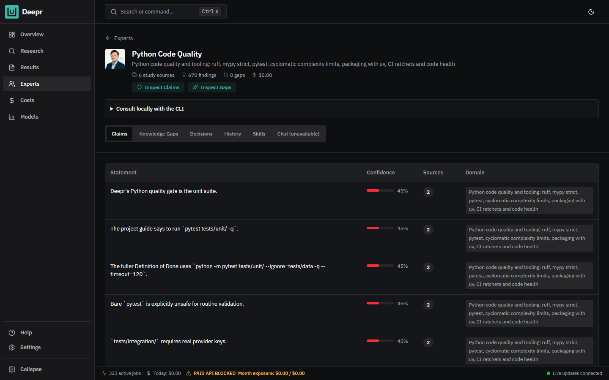

# Deepr

[](https://github.com/blisspixel/deepr/actions/workflows/ci.yml)
[](LICENSE)
[](https://www.python.org/downloads/)
[](https://github.com/blisspixel/deepr/releases/tag/v2.50.9)

**Persistent domain experts built from bounded, auditable research.**

Deepr turns research into durable beliefs, gaps, contradictions, confidence,
citations, provenance, and outcomes. It prefers owned local models, then proven
subscription quota, with no automatic fallback to a paid API.

Deepr is for people and agent teams making recurring decisions in domains that
keep changing. Instead of rebuilding context for every run, they consult the
same inspectable expert state through the CLI or MCP and can see what changed,
what supports a position, and what remains unknown.

Beliefs, sources, graphs, and notes are the expert's cognitive infrastructure,
not the product definition. The product goal is an expert that develops through
study, judgment, prospective predictions, observed outcomes, and review-gated
revision, then performs better on future problems. Deepr now preserves those
inputs as inspectable records; automatic outcome-driven learning and
longitudinal proof of better judgment remain roadmap work.

## Build a durable expert fleet

<p align="center">
  
</p>

The pictured maintainer fleet keeps its selected 25 flagship experts in focus
while preserving its complete roster. Flagship membership is user-curated local
state, not a 25-expert clean-install guarantee. Each card exposes the expert's
standpoint, positions, studied findings, retained sources, and readiness from
durable state.

## Turn evidence into reusable judgment

<p align="center">
  
</p>

Expert profiles keep claims, confidence, source lineage, gaps, decisions, and
history inspectable after a research run ends. The structured belief store is
authoritative; reports, digests, and portable exports are regenerable views.

## Keep the spend boundary visible

<p align="center">
  
</p>

Local and eligible plan-quota work stay at `$0` marginal API cost. Metered work
never becomes an automatic fallback and cannot turn the local wallet into an
open check.

## Capacity

| Class | Current posture |
| --- | --- |
| Local Ollama | Preferred for expert setup, maintenance, evaluation, and consultation after endpoint ownership is proven. Records $0 and does not consume wallet capacity. |
| Plan quota | Uses an existing subscription only when authentication, tool confinement, remaining quota, and disabled paid overage are proven. Claude Code is the current executable adapter. Successful work records $0 at the margin. |
| Metered API | No automatic fallback. The attended absorb path requires verified provider prepaid-no-overage or a hard provider ceiling, plus a cumulative Deepr wallet, a separate finite job ceiling, explicit confirmation, and a durable reservation. Other metered surfaces remain gated. |

A local wallet is cumulative operator authorization, not provider credit. Paid
dispatch also requires authenticated proof of provider-side prepaid capacity or
a hard stop with overage disabled. The current release ships no production
account-control verifier, so metered execution remains blocked and cannot be
enabled by funding a wallet, setting a budget, or approving a prompt.

```bash
deepr capacity
deepr research "A bounded premium question" --provider openai --model o4-mini-deep-research --preview
deepr research "Compare model families" --provider openrouter --model qwen/qwen3.8-flash --preview
deepr providers openrouter-check
deepr costs doctor
```

OpenRouter is visible/read-only for bounded comparison. Seven exact model slugs
can be previewed, while automatic routing, expert routing, evaluation, and paid
dispatch remain blocked. The public route check needs no key; the separate
current-key check uses a hidden prompt by default and makes no inference
request. An explicit checkout-local `.env` source is documented for local use.
Neither check authorizes dispatch.

See [Capacity and Cost](docs/CAPACITY.md) for the operating and billing
boundary, [Models](docs/MODELS.md#openrouter-preview-catalog) for provider-route
proposals and bounded price classes, and the
[OpenRouter design note](docs/design/openrouter-metered-gateway.md) for the
execution gates that remain.

## Install

Windows PowerShell:

```powershell
powershell -ExecutionPolicy ByPass -c "irm https://raw.githubusercontent.com/blisspixel/deepr/main/scripts/install.ps1 | iex"
```

Linux and macOS:

```bash
curl -fsSL https://raw.githubusercontent.com/blisspixel/deepr/main/scripts/install.sh | bash
```

Installers use the latest verified GitHub Release wheel in an isolated pipx
environment. PyPI publication is not enabled.

## Quick start

```bash
deepr init
deepr doctor --skip-connectivity
deepr capacity
deepr expert make "My Domain Expert" --local -d "The decisions this expert supports"
deepr expert retain "My Domain Expert" ./source.md --title "Trusted starting source"
deepr expert study "My Domain Expert" --local
deepr expert brief "My Domain Expert" --local
deepr expert consult "What should we decide next?" --expert "My Domain Expert" --local
```

Save one UTF-8 source you trust as `source.md` before running the retain step.
Creating a profile is not learning: retain makes the evidence re-readable,
study extracts cited findings, and brief forms the inspectable view that the
consult actually uses. These commands make no paid API call.

See [Quick Start](docs/QUICK_START.md) and [Supported Surface](docs/SUPPORTED_SURFACE.md)
for current workflows. The [MCP Agent Guide](docs/MCP_AGENT_TEST_GUIDE.md)
covers the 36 MCP tools, dual-era `2026-07-28` protocol, and
`deepr mcp conformance`. Portable packaging, OKF export, and the OpenClaw
host-profile reference are documented in [Supported Surface](docs/SUPPORTED_SURFACE.md).

## Documentation

- [Approach contract](docs/APPROACH.md) - what the method claims, refuses, and leaves experimental
- [Supported Surface](docs/SUPPORTED_SURFACE.md) - what currently runs
- [Install](docs/INSTALL.md)
- [Quick Start](docs/QUICK_START.md)
- [Capacity and Cost](docs/CAPACITY.md)
- [Experts](docs/EXPERTS.md)
- [MCP Agent Guide](docs/MCP_AGENT_TEST_GUIDE.md)
- [Architecture](docs/ARCHITECTURE.md)
- [Models](docs/MODELS.md)
- [Threat Model](docs/security/THREAT_MODEL.md)
- [Roadmap](ROADMAP.md)
- [Changelog](docs/CHANGELOG.md)
- [Contributing](CONTRIBUTING.md)

## Development

```bash
uv pip install -e ".[dev,full]"
python -m pytest tests/unit/ --ignore=tests/data -q
ruff check src/deepr/
ruff format --check src/deepr/
python scripts/check_file_sizes.py
python scripts/check_ratchets.py
python scripts/check_paid_api_boundaries.py
```

Do not run bare `pytest`: integration tests can contact real providers. The
blocking unit suite requires at least 80 percent branch coverage.

## License

[Apache 2.0](LICENSE)
