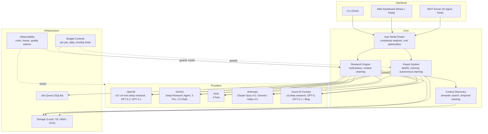

# Deepr Architecture

## Overview

Deepr is an agentic research platform that uses AI models to conduct deep research, build domain experts, and synthesize knowledge.

## System Diagram



## Design Decisions

- **Local-first with SQLite, not Postgres.** Research results, expert profiles, job queues, and cost tracking all use SQLite. No database server to run, no connection strings to manage. Users `pip install` and go. Cloud deployment swaps in DynamoDB/CosmosDB/Firestore via storage abstractions, but the local experience stays zero-config.

- **Experts are not just RAG.** Most "chat with your docs" tools do retrieval then generation and stop there. Deepr experts have a metacognition layer — they track what they know (claims with confidence), recognize what they don't know (gaps with priority), and (in agentic mode) autonomously research to fill those gaps. The knowledge persists permanently, so the expert improves over time rather than resetting each session.

- **Auto-mode routing analyzes query complexity before choosing a model.** Simple factual questions go to grok-4-fast at $0.01. Complex multi-faceted research goes to o3-deep-research at $0.50. This isn't just keyword matching — it uses a lightweight classifier to estimate complexity, then factors in which API keys are configured, current budget, and provider health scores. Batch processing 20 queries this way costs $1-2 instead of $20-40.

- **Multi-layer budget controls because research costs real money.** Per-operation limits, daily caps, monthly ceilings, pre-submission estimates, and a circuit breaker that pauses after repeated failures. The system saves progress on pause so you can resume later. An uncapped loop calling o3-deep-research could burn $100+ before you notice.

- **Provider abstraction with circuit breakers, not just try/catch.** Each provider has health scoring with exponential decay, latency percentile tracking (p50/p95/p99), and automatic disabling after sustained failures. The router uses exploration/exploitation (10% exploration by default) to discover when a degraded provider recovers.

## Core Components

### 1. Research Engine
- **Location**: `deepr/research_agent/`
- **Purpose**: Conducts multi-step research using AI models
- **Modes** (via `ResearchMode` enum in `core/settings.py`):
  - `READ_ONLY`: Browse existing knowledge only
  - `STANDARD`: Standard research with web search (~$0.25)
  - `EXTENDED`: Deep research with multi-step analysis (~$2.00)
  - `UNRESTRICTED`: Full autonomous research

### 2. Expert System
- **Location**: `deepr/experts/`
- **Purpose**: Creates domain experts that learn and answer questions
- **Components**:
  - `profile.py`: Expert metadata, usage tracking, provider config
  - `curriculum.py`: Generates learning plans
  - `learner.py`: Autonomous learning execution
  - `chat.py`: Interactive Q&A with experts
  - `router.py`: Routes queries to appropriate models
  - `beliefs.py`: Belief formation with confidence levels
  - `metacognition.py`: Gap awareness and self-assessment
  - `memory.py`: Conversation and knowledge memory
  - `synthesis.py`: Knowledge synthesis from documents
  - `temporal_knowledge.py`: Time-aware knowledge management
  - `cost_safety.py`: Budget controls and spending limits

### 3. Provider System
- **Location**: `deepr/providers/`
- **Purpose**: Unified interface to AI providers
- **Providers**:
  - OpenAI (o3/o4-mini deep research, GPT-5.2, GPT-5, GPT-4.1, GPT-4.1-mini)
  - Azure OpenAI (same models, Azure-hosted)
  - Azure AI Foundry (o3 deep research + Bing, GPT-5, GPT-4.1)
  - xAI (Grok 4 Fast)
  - Google (Gemini 3.1 Pro, 3 Flash, 2.5 Flash, Deep Research Agent)
  - Anthropic (Claude Opus 4.6, Sonnet 4.5, Haiku 4.5)

### 4. Model Registry
- **Location**: `deepr/providers/registry.py`
- **Purpose**: Single source of truth for model capabilities
- **Contains**:
  - Model costs
  - Latency estimates
  - Context windows
  - Specializations (reasoning, speed, cost, etc.)

**CRITICAL**: When new models are released (GPT-5.3, Grok 5, etc.), update ONLY the registry. Never hardcode model names elsewhere.

### 5. Queue System
- **Location**: `deepr/queue/`
- **Purpose**: Manages research job execution
- **Supports**:
  - Local queue (SQLite)
  - Azure Queue Storage (production)

### 6. Storage System
- **Location**: `deepr/storage/`
- **Purpose**: Stores research results and expert knowledge
- **Supports**:
  - Local filesystem
  - Azure Blob Storage (production)

## Data Flow

### Research Flow
```
User Query
    |
Research Planner (generates plan)
    |
Queue System (schedules jobs)
    |
Research Agent (executes with AI model)
    |
Storage System (saves results)
    |
User receives report
```

### Expert Flow
```
Create Expert
    |
Curriculum Generator (plans learning topics)
    |
Research Agent (learns each topic)
    |
Vector Store (stores knowledge)
    |
Expert ready to answer questions
```

## Model Selection

**CRITICAL**: All models are defined in `deepr/providers/registry.py`. This is the SINGLE SOURCE OF TRUTH. When GPT-5.3 or Grok 5 are released, update ONLY the registry. Never hardcode model names.

### Current Models

- **GPT-5.2** (OpenAI): $0.25, 2s, best for planning/curriculum
- **o3-deep-research** (OpenAI): $0.50, 2-5min, comprehensive multi-step research
- **o4-mini-deep-research** (OpenAI): $2.00, 60s, deep research with extended reasoning
- **Grok 4 Fast** (xAI): $0.01, 1s, best for quick lookups
- **Gemini 3.1 Pro** (Google): $0.20, 4s, 1M context for large docs (2x pricing >200K tokens)
- **Gemini Deep Research** (Google): $1.00, 5-20min, async research with Google Search
- **Gemini 2.5 Flash** (Google): $0.002, 1.5s, cheapest option for general queries
- **Claude Opus 4.6** (Anthropic): $0.80, 15s, best for complex reasoning with Adaptive Thinking
- **Claude Sonnet 4.5** (Anthropic): $0.48, 3s, balanced quality/cost for coding
- **Claude Haiku 4.5** (Anthropic): $0.05, 1.5s, fast and cheap for simple queries

Models are selected based on:
- **Task complexity**: Simple vs complex reasoning
- **Budget**: Cost constraints
- **Speed**: Latency requirements
- **Context size**: Amount of information to process

See `deepr/providers/registry.py` for full model capabilities.

## Configuration

Configuration is managed through:
- `deepr/config.py`: Main configuration
- `.env`: Environment variables (API keys, etc.)
- `deepr/config/`: Provider-specific configs

## Key Design Principles

1. **Single Source of Truth**: Model registry for all model info
2. **Provider Abstraction**: Unified interface across providers
3. **Async by Default**: All I/O operations are async
4. **Cost Tracking**: Every operation tracks costs
5. **Stateless**: Research jobs can be resumed/retried

## Directory Structure

```
deepr/
├── api/              # REST API (Flask)
├── cli/              # Command-line interface (Click)
│   └── commands/
│       └── semantic/ # research, artifacts, experts modules
├── config/           # Configuration management
├── core/             # Core business logic
├── experts/          # Expert system (beliefs, memory, learning)
├── formatting/       # Output formatting utilities
├── mcp/              # Model Context Protocol server
├── observability/    # Cost tracking, provider routing, quality metrics
├── providers/        # AI provider integrations
├── queue/            # Job queue system
├── research_agent/   # Research execution
├── routing/          # Auto mode query routing
├── services/         # Business logic services
├── storage/          # Data persistence
├── templates/        # Prompt templates
├── tools/            # Utility tools (web search, etc.)
├── utils/            # General utilities (scraping, etc.)
├── web/              # Web interface
├── webhooks/         # Webhook handlers
└── worker/           # Background job processing
```

## Extension Points

To add new capabilities:

1. **New AI Provider**: Implement `BaseProvider` in `deepr/providers/`
2. **New Model**: Add to `MODEL_CAPABILITIES` in `registry.py`
3. **New Research Mode**: Extend `ResearchMode` enum
4. **New Storage Backend**: Implement `BaseStorage` interface

## Performance Considerations

- **Caching**: Prompt caching reduces costs by 90%
- **Parallel Execution**: Multiple research jobs run concurrently
- **Model Selection**: Router picks cheapest model that meets requirements
- **Context Management**: Automatic context window management

## Security

### Threat Model

Deepr handles sensitive data (API keys, research content, expert knowledge) and makes external API calls. This section documents security considerations and mitigations.

#### Assets to Protect

1. **API Keys** - Provider credentials (OpenAI, xAI, Google, Anthropic)
2. **Research Content** - User queries and research results
3. **Expert Knowledge** - Synthesized beliefs and documents
4. **Cost/Budget** - Prevent unauthorized spending

#### Threat Categories

| Threat | Risk | Mitigation |
|--------|------|------------|
| API key exposure | High | Environment variables only, never in code/logs |
| Path traversal | Medium | Input validation, sandboxed file operations |
| Prompt injection | Medium | System prompts are not user-modifiable |
| Cost runaway | Medium | Session budgets, daily limits, circuit breakers |
| Data exfiltration | Low | Local storage by default, no external telemetry |

### Security Controls

#### API Key Handling

- Keys loaded from environment variables only
- Never logged, even at DEBUG level
- Not included in error messages
- Validated on startup (fail fast)

```python
# Good
api_key = os.getenv("OPENAI_API_KEY")

# Bad - never do this
api_key = "sk-..."  # Hardcoded
logger.debug(f"Using key: {api_key}")  # Logged
```

#### Path Traversal Protection

All file operations validate paths:

```python
# deepr/storage/local.py
def _validate_path(self, path: Path) -> bool:
    """Ensure path is within allowed directory."""
    resolved = path.resolve()
    return resolved.is_relative_to(self.base_dir)
```

User-provided paths are:
- Resolved to absolute paths
- Checked against allowed directories
- Rejected if they escape the sandbox

#### Input Validation

User inputs are validated before use:

- **Expert names**: Alphanumeric + hyphens only
- **File paths**: Must be within workspace
- **Queries**: Length limits, no control characters
- **Budget values**: Positive numbers within limits

#### Cost Safety

Multiple layers prevent runaway costs. Implementation in `deepr/experts/cost_safety.py`.

**Hard Limits (Cannot Be Overridden):**
- Per Operation: $10 maximum
- Per Day: $50 maximum
- Per Month: $500 maximum

**Configurable Limits (Defaults):**
- Per Operation: $5
- Per Day: $25
- Per Month: $200

**Features:**
- Session-level cost tracking with alerts at 50%, 80%, 95%
- Circuit breaker for repeated failures (auto-pause after 3 consecutive failures)
- Audit logging of all cost-incurring operations
- Graceful pause/resume for daily/monthly limits

**CLI Budget Validation:**
- Warns for budgets > $10
- Requires confirmation for budgets > $25
- Shows daily/monthly spending status with `/status` command in expert chat

**Pause/Resume for Long-Running Processes:**

When learning or curriculum execution hits limits:
1. Progress saved to `data/experts/<name>/knowledge/learning_progress.json`
2. Clear message about when to resume
3. Resume with `deepr expert resume "<name>"`

```bash
# If daily limit hit during learning:
PAUSED - Daily/Monthly Limit Reached
Progress: 8 topics completed, 7 remaining

To resume:
  deepr expert resume "Azure Architect"
```

#### Rate Limiting

- API endpoints have request rate limits
- Provider calls respect upstream rate limits
- Exponential backoff on rate limit errors

### Audit Logging

Security-relevant events are logged:

- API key validation (success/failure)
- Cost threshold alerts
- Research job submissions
- Expert creation/deletion

Logs do NOT contain:
- API keys or tokens
- Full research content
- User credentials

### Recommendations for Deployment

1. **Use environment variables** for all secrets
2. **Set budget limits** appropriate for your use case
3. **Review logs** for unusual activity
4. **Keep dependencies updated** for security patches
5. **Use HTTPS** for web interface in production

### Known Limitations

- No authentication on local web interface (designed for local use)
- No encryption at rest for local storage
- API keys have full provider access (no scoping)

For production deployments, consider:
- Adding authentication layer
- Encrypting sensitive data at rest
- Using provider-specific API key scoping where available

## Observability

The `deepr/observability/` module provides monitoring and cost management:

### Cost Dashboard (`costs.py`)
- Per-job cost tracking with provider/model breakdown
- Daily, weekly, monthly cost aggregation
- Budget alerts with configurable thresholds
- Atomic persistence to prevent data corruption

### Provider Router (`provider_router.py`)
- Autonomous provider selection based on cost, latency, and availability
- Fallback handling when providers fail
- Health scoring with exponential decay
- Metrics tracking (success rate, latency, costs)

### Quality Metrics (`quality_metrics.py`)
- Response quality scoring
- Model performance comparison
- Research output evaluation

### Traces (`traces.py`)
- Request/response logging
- Debugging support for multi-step workflows

### Monitoring Summary
- Cost tracking per job
- Latency metrics per provider
- Error rates and retry logic
- Usage analytics in web dashboard
