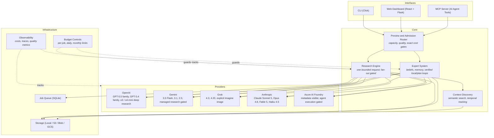

# Deepr Architecture

## Overview

Deepr is an agentic research platform that uses AI models to conduct deep research, build domain experts, and synthesize knowledge.

## System Diagram


```mermaid
graph TB
    subgraph Interfaces
        CLI["CLI (Click)"]
        Web["Web Dashboard (React + Flask)"]
        MCP["MCP Server (AI Agent Tools)"]
    end

    subgraph Core
        Router["Preview and Admission Router<br/><i>capacity, quality, exact cost gates</i>"]
        Research["Research Engine<br/><i>one bounded request; fan-out gated</i>"]
        Experts["Expert System<br/><i>beliefs, memory, verified local/plan loops</i>"]
        Context["Context Discovery<br/><i>semantic search, temporal tracking</i>"]
    end

    subgraph Providers
        OpenAI["OpenAI<br/>GPT-5.5 family, GPT-5.4 family, o3 / o4-mini deep research"]
        Gemini["Gemini<br/>3.5 Flash, 3.1, 2.5; managed research gated"]
        Grok["Grok<br/>4.3, 4.20, explicit Imagine image"]
        Anthropic["Anthropic<br/>Claude Sonnet 5, Opus 4.8, Fable 5, Haiku 4.5"]
        AzureFoundry["Azure AI Foundry<br/>metadata visible; agent execution gated"]
    end

    subgraph Infrastructure
        Queue["Job Queue (SQLite)"]
        Storage["Storage (Local / S3 / Blob / GCS)"]
        Observe["Observability<br/><i>costs, traces, quality metrics</i>"]
        Budget["Budget Controls<br/><i>per-job, daily, monthly limits</i>"]
    end

    CLI --> Router
    Web --> Router
    MCP --> Router

    Router --> Research
    Router --> Experts
    Research --> Context

    Research --> OpenAI
    Research --> Gemini
    Research --> Grok
    Research --> Anthropic
    Research --> AzureFoundry
    Experts --> OpenAI
    Experts --> Gemini
    Experts --> Grok
    Experts --> Anthropic
    Experts --> AzureFoundry

    Research --> Queue
    Research --> Storage
    Experts --> Storage
    Context --> Storage

    Budget -.->|"guards"| Research
    Budget -.->|"guards"| Experts
    Observe -.->|"tracks"| Research
    Observe -.->|"tracks"| Providers
```

Provider edges show registry and adapter boundaries, not unconditional runtime
dispatch. In v2.36, one request runs only when its provider/model/tool envelope
is finite and fully priced. Managed Gemini Deep Research, xAI multi-agent
research, Azure Foundry agents, hosted context, automatic metered fallback, and
metered multi-call fan-out fail closed.

## Design Decisions

- **Local-first with SQLite, not Postgres.** Research results, expert profiles, job queues, and cost tracking all use SQLite. No database server to run, no connection strings to manage. Users `pip install` and go. Cloud deployment swaps in DynamoDB/CosmosDB/Firestore via storage abstractions, but the local experience stays zero-config.

- **Experts are not just RAG.** Deepr experts track claims, confidence, evidence,
  contradictions, gaps, perspective state, and durable loop outcomes. Explicit
  local and non-metered plan workflows can propose and verify updates. Standalone
  metered agentic chat and expert lifecycle mutation are gated in v2.36, and no
  conversation can authorize its own spend or permanent belief writes.

- **Routing separates preview from execution.** Registry metadata, admitted
  quality, local readiness, trusted plan-quota evidence, and exact API envelopes
  inform previews and selected scheduled maintenance paths. Global
  cheapest-first runtime execution and automatic cross-provider metered
  fallback are not shipped in v2.36. Lexical signals may route a preview but
  never decide semantic complexity or authorize spend.

- **Multi-layer budget controls because research costs real money.** Per-operation limits, daily caps, monthly ceilings, pre-submission estimates, and a circuit breaker that pauses after repeated failures. The system saves progress on pause so you can resume later. An uncapped loop calling o3-deep-research could burn $100+ before you notice.

- **Provider abstraction preserves lifecycle ownership.** Each accepted job
  records its provider for polling, cancellation, settlement, and cleanup.
  Health and latency metrics remain observable, but a failed provider never
  triggers an unapproved metered fallback or exploratory dispatch.

## Core Components

### 1. Research Engine
- **Location**: `src/deepr/research_agent/`
- **Purpose**: Prepares and tracks provider research under explicit bounds.
- **Policy modes** (via `ResearchMode` in `core/settings.py`) classify tool
  permissions. They are not cost quotes or execution claims. `READ_ONLY` is
  provider-free; `STANDARD`, `EXTENDED`, and `UNRESTRICTED` remain subordinate
  to the v2.36 request, parent-budget, and interface gates.

### 2. Expert System
- **Location**: `src/deepr/experts/`
- **Purpose**: Creates domain experts that learn and answer questions
- **Components**:
  - `profile.py`: Expert metadata, usage tracking, provider config
  - `curriculum.py`: Generates learning plans
  - `learner.py`: Autonomous learning execution
  - `chat.py`: Interactive Q&A with experts
  - `router.py`: Routes queries to appropriate models
  - `beliefs.py`: The temporal knowledge graph's canonical store - beliefs
    with confidence (time decay + deterministic source-trust ceilings:
    tertiary caps at 0.60/0.80, secondary+ uncapped), typed edges
    (supports/contradicts/enables/derived_from), and an append-only
    `events.jsonl` belief event log (the cost-ledger pattern applied to
    knowledge)
  - `perspective.py`: Read-side temporal queries - `what_changed` (delta
    since a timestamp, including temporal edge qualifier summaries when
    present), `contested` (open contradiction pairs), `explain_belief`
    (evidence roots + confidence trajectory + graph chains with temporal
    contexts), and `temporal_edges` (valid-time and observed-time filters over
    typed edge qualifiers)
  - `continuity_metrics.py`: `$0` memory-quality checks over stored state,
    including visibility of temporal edge qualifiers through read and generated
    digest surfaces
  - `digest.py`: Regenerated browsable view over the store (byte-stable,
    derived-view marker, temporal edge qualifier section; the store stays
    canonical)
  - `sync.py` / `gap_fill.py`: Budget-bounded loop-closers - scheduled
    topic freshness and gap-fill execution, both absorbing through the
    verification-gated pipeline
  - `report_absorber.py`: Verification-gated output-to-knowledge promotion
    (extraction, dedup, contradiction-as-signal flagging)
  - `health_check.py`: Read-only knowledge-state audit with an action menu
  - `metacognition.py`: Gap awareness and self-assessment
  - `memory.py`: Conversation and knowledge memory
  - `synthesis.py`: Knowledge synthesis from documents
  - `temporal_knowledge.py`: Time-aware knowledge management
  - `cost_safety.py`: Budget controls and spending limits

### 3. Provider System
- **Location**: `src/deepr/providers/`
- **Purpose**: Unified interface to AI providers
- **Providers**:
  - OpenAI (GPT-5.5 family, GPT-5.4 family, GPT-5 family, GPT-4.1 family, o3/o4-mini deep research)
  - Azure OpenAI (same models, Azure-hosted)
  - Azure AI Foundry model metadata (Agent/Thread/Run execution gated in v2.36)
  - xAI (Grok 4.3, Grok 4.20, explicit premium image generation)
  - Google (Gemini 3.5 Flash, Gemini 3.1, Gemini 2.5; managed Deep Research gated)
  - Anthropic (Claude Sonnet 5, Opus 4.8, Fable 5, Haiku 4.5)

### 4. Model Registry
- **Location**: `src/deepr/providers/registry.py`
- **Purpose**: Single source of truth for model capabilities
- **Contains**:
  - Model costs
  - Latency estimates
  - Context windows
  - Specializations (reasoning, speed, cost, etc.)

**CRITICAL**: When new models are released, update the registry first, then add provider mapping, pricing, usage-settlement, and routing tests as needed. Do not hardcode model names in feature code or secondary docs.

### 5. Queue System
- **Location**: `src/deepr/queue/`
- **Purpose**: Manages research job execution
- **Supports**:
  - Local queue (SQLite)
  - Azure Queue Storage (production)

### 6. Storage System
- **Location**: `src/deepr/storage/`
- **Purpose**: Stores research results and expert knowledge
- **Supports**:
  - Local filesystem
  - Azure Blob Storage (production)

## Data Flow

### Research Flow
```
User Query
    |
Research Planner (generates plan)
    |
Queue System (schedules jobs)
    |
Research Agent (executes with AI model)
    |
Storage System (saves results)
    |
User receives report
```

### Expert Flow
```
Create Local Expert
    |
Structured Beliefs, Gaps, and Source Packs
    |
Explicit Local or Plan-Quota Sync
    |
Verification and One Belief-Store Commit
    |
Local or Plan Query and Consult
```

Metered curriculum generation, hosted vector storage, standalone expert chat,
and API lifecycle mutation fail closed in v2.36 until their nested calls and
storage side effects share one durable parent transaction.

## Model Selection

**CRITICAL**: All models are defined in `src/deepr/providers/registry.py`. This
is the single source of truth. When providers release new models, update the
registry first, then add provider mapping, pricing, usage-settlement, and
routing tests as needed. Do not hardcode model names in feature code or
secondary docs.

### Current Registry Highlights

- **OpenAI**: GPT-5.5 and GPT-5.4 families for synthesis and planning, plus o3/o4-mini deep research for explicitly deep async jobs.
- **xAI**: Grok text-model metadata is available where pricing is complete; multi-agent research is gated in v2.36.
- **Google Gemini**: Gemini 3.5 Flash and 3.1/2.5 model metadata is available; the managed Deep Research Agent is gated in v2.36.
- **Anthropic**: Claude Sonnet 5 for balanced chat/synthesis, Opus 4.8 for high-reasoning work, and Fable 5 as premium opt-in capacity.
- **Azure AI Foundry**: Deployment metadata remains available; Agent/Thread/Run work with Bing grounding is gated until the multi-call and tool-cost envelope is complete.

Run `python scripts/discover_models.py --show-registry` for the current exact
model IDs, pricing estimates, context windows, and deprecation flags.

Models are selected based on:
- **Task complexity**: Simple vs complex reasoning
- **Budget**: Cost constraints
- **Speed**: Latency requirements
- **Context size**: Amount of information to process

See `src/deepr/providers/registry.py` for full model capabilities.

## Configuration

Configuration is managed through:
- `deepr/config.py`: Main configuration
- `.env`: Environment variables (API keys, etc.)
- `deepr/config/`: Provider-specific configs

## Key Design Principles

1. **Single Source of Truth**: Model registry for all model info
2. **Provider Abstraction**: Unified interface across providers
3. **Async by Default**: All I/O operations are async
4. **Cost Tracking**: Every operation tracks costs
5. **Stateless**: Research jobs can be resumed/retried

## Directory Structure

```
deepr/
├── api/              # REST API (Flask)
├── cli/              # Command-line interface (Click)
│   └── commands/
│       └── semantic/ # research, artifacts, experts modules
├── config/           # Configuration management
├── core/             # Core business logic
├── experts/          # Expert system (beliefs, memory, learning)
├── formatting/       # Output formatting utilities
├── mcp/              # Model Context Protocol server
├── observability/    # Cost tracking, provider routing, quality metrics
├── providers/        # AI provider integrations
├── queue/            # Job queue system
├── research_agent/   # Research execution
├── routing/          # Auto mode query routing
├── services/         # Business logic services
├── storage/          # Data persistence
├── templates/        # Prompt templates
├── tools/            # Utility tools (web search, etc.)
├── utils/            # General utilities (scraping, etc.)
├── web/              # Web interface
├── webhooks/         # Webhook handlers
└── worker/           # Background job processing
```

## Extension Points

To add new capabilities:

1. **New AI Provider**: Implement `BaseProvider` in `src/deepr/providers/`
2. **New Model**: Add to `MODEL_CAPABILITIES` in `registry.py`
3. **New Research Mode**: Extend `ResearchMode` enum
4. **New Storage Backend**: Implement `BaseStorage` interface

## Performance Considerations

- **Caching**: Prompt caching reduces costs by 90%
- **Parallel Execution**: Multiple research jobs run concurrently
- **Model Selection**: Router picks cheapest model that meets requirements
- **Context Management**: Automatic context window management

## Security

### Threat Model

Deepr handles sensitive data (API keys, research content, expert knowledge) and makes external API calls. This section documents security considerations and mitigations.

#### Assets to Protect

1. **API Keys** - Provider credentials (OpenAI, xAI, Google, Anthropic)
2. **Research Content** - User queries and research results
3. **Expert Knowledge** - Synthesized beliefs and documents
4. **Cost/Budget** - Prevent unauthorized spending

#### Threat Categories

| Threat | Risk | Mitigation |
|--------|------|------------|
| API key exposure | High | Environment variables only, never in code/logs |
| Path traversal | Medium | Input validation, sandboxed file operations |
| Prompt injection | Medium | User prompts are sanitized; untrusted source/tool text, document previews, campaign context, and team findings are delimited before model use; derived MCP handoff and loop-status reads neutralize directive and tool-spoof canaries before host consumption; `deepr eval red-team` tracks local attack-success-rate for built-in boundary probes; belief absorption remains verify gated |
| Cost runaway | Medium | Session budgets, daily limits, circuit breakers |
| Data exfiltration | Low | Local storage by default, no external telemetry |

### Security Controls

#### API Key Handling

- Keys loaded from environment variables only
- Never logged, even at DEBUG level
- Not included in error messages
- Validated on startup (fail fast)

```python
# Good
api_key = os.getenv("OPENAI_API_KEY")

# Bad - never do this
api_key = "sk-..."  # Hardcoded
logger.debug(f"Using key: {api_key}")  # Logged
```

#### Path Traversal Protection

All file operations validate paths:

```python
# src/deepr/storage/local.py
def _validate_path(self, path: Path) -> bool:
    """Ensure path is within allowed directory."""
    resolved = path.resolve()
    return resolved.is_relative_to(self.base_dir)
```

User-provided paths are:
- Resolved to absolute paths
- Checked against allowed directories
- Rejected if they escape the sandbox

#### Input Validation

User inputs are validated before use:

- **Expert names**: Alphanumeric + hyphens only
- **File paths**: Must be within workspace
- **Queries**: Length limits, no control characters
- **Budget values**: Positive numbers within limits

#### Agentic Red-Team Metrics

`deepr eval red-team` is a local `$0` verifier for the controls above. It
checks built-in prompt-injection, jailbreak, data-exfiltration,
tool-call/tool-result spoofing, MCP handoff and loop-status read-path, and
memory trust-floor probes, reports attack-success-rate, and fails if a built-in
attack succeeds. These checks are workflow guards over prompt boundaries,
derived read payloads, and confidence ceilings; they do not decide whether a
claim is true. Use `--save` to persist a local `data/benchmarks/red_team_*.json`
artifact for release-to-release trend review.

#### Cost Safety

Multiple layers prevent runaway costs. Implementation in `src/deepr/experts/cost_safety.py`.

**Hard Limits (Cannot Be Overridden):**
- Per Operation: $10 maximum
- Per Day: $50 maximum
- Per Month: $500 maximum

**Configurable Limits (Defaults):**
- Per Operation: $5
- Per Day: $25
- Per Month: $200

**Features:**
- Session-level cost tracking with alerts at 50%, 80%, 95%
- Circuit breaker for repeated failures (auto-pause after 3 consecutive failures)
- Audit logging of all cost-incurring operations
- Graceful pause/resume for daily/monthly limits

**CLI Budget Validation:**
- Warns for budgets > $10
- Requires confirmation for budgets > $25
- Shows daily/monthly spending status with `/status` command in expert chat

**Paused long-running expert state:**

Historical learning progress remains inspectable for recovery. The metered
`deepr expert resume` dispatch path is gated in v2.36 until every nested call
shares the durable parent budget and exact settlement transaction. Use explicit
local or documented non-metered plan maintenance instead of resuming through a
provider API.

#### Rate Limiting

- API endpoints have request rate limits
- Provider calls return typed upstream rate-limit state. Deepr-created bounded
  clients disable hidden SDK retries so one reservation cannot multiply calls.

### Audit Logging

Security-relevant events are logged:

- API key validation (success/failure)
- Cost threshold alerts
- Research job submissions
- Expert creation/deletion

Logs do NOT contain:
- API keys or tokens
- Full research content
- User credentials

### Recommendations for Deployment

1. **Use environment variables** for all secrets
2. **Set budget limits** appropriate for your use case
3. **Review logs** for unusual activity
4. **Keep dependencies updated** for security patches
5. **Use HTTPS** for web interface in production

### Known Limitations

- No authentication on local web interface (designed for local use)
- No encryption at rest for local storage
- API keys have full provider access (no scoping)

For production deployments, consider:
- Adding authentication layer
- Encrypting sensitive data at rest
- Using provider-specific API key scoping where available

## Observability

The `src/deepr/observability/` module provides monitoring and cost management:

### Cost Dashboard (`costs.py`)
- Per-job cost tracking with provider/model breakdown
- Daily, weekly, monthly cost aggregation
- Budget alerts with configurable thresholds
- Atomic persistence to prevent data corruption

### Routing (`routing/`)
- Read-only route previews and registry/eligibility metadata
- Explicit local, plan, and bounded API capacity selection
- Health, success, latency, and cost metrics
- No automatic cross-provider metered fallback in v2.36

### Quality Metrics (`quality_metrics.py`)
- Response quality scoring
- Model performance comparison
- Research output evaluation

### Traces (`traces.py`)
- Request/response logging
- Debugging support for multi-step workflows

### Monitoring Summary
- Cost tracking per job
- Latency metrics per provider
- Error rates and retry logic
- Usage analytics in web dashboard
