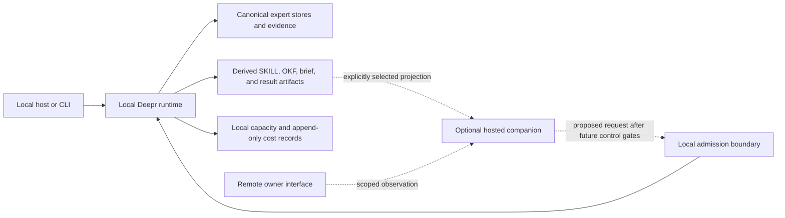

# Local-first agent runtime options

Status: researched proposal, 2026-09-04. Default execution and authoritative
expert state remain local. No cloud runtime, provisioning command, new
authority contract, or automatic skill execution is introduced by this note.

## Decision

Make a maintained Deepr expert easy to use as a durable role inside a local
agent workflow. Let an operator package its instructions, choose which
knowledge to share, and inspect its results through a compatible host. An
optional hosted companion could later make selected results reachable when the
operator is away. Hosted execution is a separate, later option with its own
capacity, identity, privacy, and total-cost proof.

Keep the existing Python runtime and local structured stores. Use Agent
Plugins and Agent Skills to distribute the integration, MCP to invoke bounded
capabilities, and OKF to exchange selected knowledge. Cloudflare is a promising
candidate for a thin companion, subject to the deployment gates below. It is
not a reason to port Deepr, move the entire expert fleet into an actor service,
or make an account part of installation.

This preserves the specialist-role contract in [Approach](../APPROACH.md) and
the [external harness bridge](external-harness-investigation-bridge.md). It
prepares design work behind the [active release plan](../../ROADMAP.md#active-release-plan):
v2.51 value proof, v2.52 grounded prediction resolution, v2.53 parent
transactions, v2.54 observation, then v2.55 control. A cloud demonstration does
not satisfy or reorder those gates.

## What the user would gain

Consider a local expert that tracks changing database technology. The operator
retains sources, studies them, asks for a decision, and later records what
happened. A proposed creator would turn that working expert into a reusable
role with a clear purpose, examples of useful questions, required tools, and
known limitations. Installing its skill in another local host would preserve
the same expert identity and evidence instead of creating a new chat persona.

The optional companion would solve a narrower availability problem: inspect
the last explicitly shared brief from another device, see whether the owning
machine is available, and, after control is proven, leave a bounded request for
that machine. If the machine is asleep, the interface says that execution is
waiting. The last snapshot remains visibly dated. No remote model is selected
to conceal the unavailable local machine.

Success is less repeated setup, fewer unsupported or stale decisions, and
recoverable work. Agent count, an always-online animation, and the amount of
stored conversation are not measures of expertise.

## Current surface and proposed additions

[Supported Surface](../SUPPORTED_SURFACE.md) wins if an older design note
describes a broader capability.

| Capability | Status | Consequence for this design |
| --- | --- | --- |
| Local expert setup, retained sources, study, brief, and consult | Works now, with each command's documented local capacity gates | Start the experience here; an account and hosted model are unnecessary. |
| Blueprint drafts, structural preflight, operator-attested revisions, decision outcomes, and four-arm evaluation artifacts | Works now as local contracts | Reuse these records; a draft or successful schema check is not semantic review. |
| Agent Plugins package and per-expert SKILL export | Works now as packaging | The portable package has ten read-only MCP tools and an isolated workspace. A separate expert skill is a pointer that must check the target host's actual tool inventory. |
| OKF 0.2 profile export and offline form validation | Works now | Export is a derived view. Import is untrusted, verification-gated evidence. Runtime computation and attestation are not shipped. |
| Inbound local MCP and local container | Works now within their documented modes | Reuse the Python server and scoped authority. Local HTTP is not a verified public deployment. |
| Cloudflare, AWS, Azure, and GCP deployment files | Inert reference only | No cloud deployment is supported. The current Cloudflare Worker exports no fetch handler. |
| Integrated agent or skill creator, hosted observation, remote queue, and hosted execution | Planned here | Each increment needs its own design, tests, and promotion evidence. |
| Concurrent local and cloud mutation of the same expert | Not supported | Current multi-device portability is sequential. Never synchronize a live SQLite file as a multi-writer database. |

The distributed plugin does not contain a fleet, a model, a scheduler, or
provider credentials. Its private host workspace can initially be empty. The
creator must make the intended expert workspace explicit rather than search
the user's machine and expose whichever data it finds.

## Runtime choices

These are architectural options, not deployable recipes or price promises.

| Option | Best use | Tradeoff and decision |
| --- | --- | --- |
| Existing local Python process | Study, consult, reviewed learning, export, and evaluation | Recommended default. The machine and its model must be available; work remains inspectable without a cloud service. |
| Operator-owned always-on machine | A local expert that should continue while a laptop sleeps | Prefer evaluating this operationally simple option before a new cloud platform. Explicitly choose the owning machine; do not claim distributed writing or zero hardware cost. |
| Cloudflare Worker with a narrow observation endpoint | Access to selected, dated projections | First hosted candidate if all account and infrastructure gates can be proven. A stateless handler may be sufficient; an Agent instance is not required just to serve MCP. |
| Cloudflare Agent backed by a Durable Object | A durable per-owner inbox or connection coordinator | Consider only after observation proves a user need for queued requests. Retain transport state and receipt references, not canonical beliefs or blanket execution authority. |
| Cloudflare Workflows | A bounded, independently operated remote procedure with durable waiting | Defer until one actual workflow cannot be served by Deepr's existing lifecycle. Do not duplicate its task graph, retries, or settlement. |
| Hosted Python container or VM | Explicit remote execution using substantially the same Python package | Later adapter, disabled until total cost, storage, teardown, and authority are proven. It creates an additional operational home for data. |
| Full rewrite on Workers or a process per expert | A hypothetical general agent platform | Reject now. Neither removes a demonstrated limitation of the expert value loop. |

Cloudflare's `Agent` class requires Durable Objects and provides server and
browser APIs. Its SQL-backed state supports persistence and client
synchronization. That is useful host infrastructure; it does not establish
expert grounding or Deepr compatibility.
[Agents API](https://developers.cloudflare.com/agents/runtime/agents-api/),
[state management](https://developers.cloudflare.com/agents/runtime/lifecycle/state/).

Current Cloudflare MCP guidance recommends stateless `createMcpHandler` and
marks `McpAgent` deprecated and feature-frozen. A future companion should pin
the exact SDK, MCP era, and profile it tests, without introducing a Durable
Object merely to give a transport session persistence.
[MCP handler APIs](https://developers.cloudflare.com/agents/model-context-protocol/apis/handler-api/).

Python Workers support pure Python, PyEmscripten wheels, and supported Pyodide
packages, with asynchronous HTTP clients. This is not proof that Deepr's
filesystem, process, dependency, or local model behavior works there. The
architectural inference is to keep Python execution on its proven platform and
use a small TypeScript adapter only if a hosted boundary becomes justified.
[Python package support](https://developers.cloudflare.com/workers/languages/python/packages/).

## Proposed architecture and authority

Dashed edges are proposed and disabled today. The local path has no dependency
on the companion. Removing a companion must leave local expert history,
installation, commands, and export usable.

The existing run and storage contracts remain authoritative. Before remote
control, specify a versioned request envelope that binds the authenticated
owner, workspace, expert identifiers, requested verb, input hashes, exact
expert revision, capacity class, finite bounds, expiry, and idempotency key.
These are proposed fields to reconcile with existing contracts, not a second
schema being silently introduced in a design note.

Keep the boundaries separate:

- The host owns conversation and the outer task. A plugin manifest, generated
  skill, model message, or host approval cannot grant new Deepr tools, network
  access, spend, or canonical writes.
- Deepr owns admission and one bounded knowledge transaction. Capability is
  checked against the actual installation before execution and again after
  reconnect. Unknown tools or a stale authorization produce a concrete
  unavailable result, not a broader fallback.
- The companion owns only its explicitly scoped delivery state. A receipt
  means a request was durably received, not that local execution started,
  succeeded, or was semantically accepted.
- An expert identifier is not an owner identity. Route keys and display names
  are not credentials. Authorize every read and control operation against its
  owner, workspace, expert, and run; reconnect and WebSocket upgrade do not
  replace per-operation authorization.

For a first stateful companion, one bounded coordinator per owner workspace is
enough to test the need. Use separate objects only when they provide measured
isolation or load benefits. Do not automatically create one actor and model
loop for every expert.

Cloudflare state can be bidirectional and broadcast to connected clients.
Accordingly, expose only projections appropriate to every admitted recipient;
do not put secrets, raw expert state, or private tool results into general
session state. Client-written fields must remain proposals. Validation must
occur before persistence and broadcast; `onStateChanged` is a notification
hook after broadcast.
[State validation](https://developers.cloudflare.com/agents/runtime/lifecycle/state/#validating-state-updates).

## Knowledge, memory, and portable artifacts

The source of truth remains the current structured expert stores, evidence,
and accepted history. A future event-authority migration must first pass the
shadow replay and historical-state gates in
[Expert Event Memory V2](expert-event-memory-v2.md). An event-shaped export does
not make that migration complete.

| State | Proposed placement and treatment |
| --- | --- |
| Beliefs, provenance, temporal edges, accepted perspective, and outcomes | Canonical local expert directory under configured roots. Preserve valid time, observation time, uncertainty, and revisions. |
| Expert purpose and evaluation evidence | Local reviewed records and hash-bound artifacts. Keep reviewer assertions distinct from verified identity and semantic quality. |
| Conversation and temporary agent scratch state | Host or run scope with explicit retention. It can propose a candidate; it cannot rewrite accepted beliefs or identity. |
| SKILL.md | Regenerable instructions or a pointer to a named expert. Bind the intended host capabilities and disclose missing prerequisites. |
| OKF bundle | Selected portable knowledge, with a manifest binding source expert/revision and export hashes. Treat an edited or returned bundle as external evidence. |
| Cloud cache | Optional minimum projection, with export time, source revision, owner, expiry, and revocation behavior. Never imply it is current live state while disconnected. |
| Credentials, active reservations, billing identity, and capacity observations | Stay at the execution origin. Do not copy them into plugin files, OKF, shared memory, or synchronized expert folders. |

OKF 0.2 describes Markdown and YAML knowledge interchange. Its current
specification explicitly defers the full runtime protocol and attester ABI.
The correct role here is a portable knowledge view, not an agent operating
system, execution receipt, or trusted remote database.
[OKF 0.2 specification](https://github.com/GoogleCloudPlatform/knowledge-catalog/blob/main/okf/SPEC.md).

For selective sharing, the operator reviews the exact export before upload.
Source inclusion must respect the operator's privacy and redistribution
choices. A private source can be omitted, but an export then discloses that its
evidence is unavailable to the recipient rather than implying independent
verification. Keep source identifiers and factual grounding separate from
content hashes: a matching hash proves bytes, not truth.

Cloudflare's memory API separates compact context, searchable information,
and loadable skills; its built-in search provider uses SQLite FTS5. This
supports a useful design pattern: keep small orientation context and retrieve
specific evidence or instructions as needed. It does not justify adding a
vector service, paid embeddings, or a second writable belief store.
[Conversation state and memory](https://developers.cloudflare.com/agents/concepts/conversation-state-and-memory/).

Concurrent replication stays deferred behind
[multi-device continuity](multi-device-expert-continuity.md). A remote receipt,
cloud timestamp, or last-write-wins merge cannot determine which contradictory
belief should win. Independent candidates may be preserved, while semantic
conflicts remain explicit for review. A cloud coordinator does not make two
disconnected local writers safe.

## A local agent and skill creator

The proposed creator should assemble a reviewable result from existing
primitives. It should not start by generating executable agent code.

1. Describe a recurring decision, intended user, and useful outcome. Draft a
   purpose and a small set of acceptance and failure cases using the existing
   blueprint workflow. An operator accepts the purpose separately from model
   authorship or quality claims.
2. Select or create a local expert, retain the chosen sources, study and brief
   locally, then try representative consultations. Show what evidence is
   missing before offering maintenance or more tools.
3. Choose the deliverable: a local expert pointer skill, an explicitly
   selected knowledge export, or a portable plugin integration. Explain where
   execution happens and which expert workspace the target host sees.
4. Compare requested operations with the target's actual advertised tools,
   backend support, and read/write mode. Produce usable instructions for that
   boundary. A read-only installation should offer inspection and clear next
   steps when synthesis is unavailable.
5. Show the exact artifact diff, source revision, tool requirements, data
   selection, and test evidence. Regenerate output from the reviewed structured
   specification; never hand-edit an expert digest into the authority source.
6. Validate the package in an isolated local installation, then review and
   export it. Installation into another host and any later widening of tools
   remain explicit operations. Preserve the prior package for rollback.
7. Record outcomes and concrete failures. Propose a revision only when held-out
   comparison demonstrates benefit. A trace is evidence for improvement, not
   permission to rewrite a prompt, skill, policy, or expert automatically.

Agent Plugins 1.0.0 defines package structure and MCP declarations; Agent
Skills defines instruction folders and progressive disclosure. Neither
standard grants authority or promises identical host installation UX. Reuse
Deepr's pinned offline validators and test the actual host profile before
claiming compatibility.
[Agent Plugins](https://agent-plugins.org/specification),
[Agent Skills](https://agentskills.io/specification),
[repository pins](../standards/pins.json).

Cloudflare's `agents/skills` is currently experimental, and its script runner
requires opt-in configuration. Its documented permissions distinguish bundled
resources, scratch output, workspace access, tools, and network access. That
separation is worth evaluating later. It does not lift Deepr's current Python
and MCP skill-execution quarantine. The first creator pilot emits instructions
and fixtures only, with no generated scripts executed and no script-runner
binding.
[Cloudflare Agent Skills](https://developers.cloudflare.com/agents/runtime/execution/agent-skills/).

## Offline, failure, and recovery behavior

| Situation | Required proposed behavior |
| --- | --- |
| Laptop asleep or local model unavailable | Show the last confirmed availability and snapshot age. Keep a future request pending or expired; do not silently run it remotely. |
| Disconnect after submitting a request | Reconnect using the same idempotency key and inspect the existing receipt. Do not create another run because an acknowledgement was lost. |
| Runtime dies after a side effect but before recording success | Recover from Deepr's durable records and any independently bound receipt. An ambiguous effect remains unresolved; no blind replay. |
| Owner cancels while a worker is disconnected | Persist cancel intent, prevent new admitted steps on reconnect, and show the last confirmed stop state. Do not promise that an in-flight external effect was undone. |
| Permission revoked or expert revision changes while queued | Reject or re-present the exact new request for admission. Reconnect cannot reuse expired authority or quietly consult a different snapshot. |
| Duplicate delivery, reordered events, or concurrent local requests | Deduplicate by bound request identity, reject conflicting payloads, preserve cursor ordering, and enforce the existing per-expert mutation exclusion. |
| Storage or log quota reached | Refuse new work that cannot durably record admission and settlement. Preserve readable completed artifacts. |
| Cloud data removed | Stop serving deleted or expired projections and prove residual-resource cleanup. Do not promise recall of copies already downloaded by recipients. |

Cloudflare fibers provide checkpoints and recovery callbacks, including local
restart testing. Recovery remains application work: the last stored snapshot
must identify which steps are safe to repeat. Workflows also retries failed
steps. The inference for Deepr is to preserve its existing idempotency and
settlement boundaries across either substrate, and to disable automatic retry
where an outcome is ambiguous.
[Fiber recovery](https://developers.cloudflare.com/agents/runtime/execution/durable-execution/),
[Workflow retries](https://developers.cloudflare.com/workflows/build/sleeping-and-retrying/).

For a future connector, prefer bounded outbound contact initiated by the local
installation over exposing an unauthenticated local service. That is a design
preference, not shipped networking. Its transport, polling, idle connection,
and origin costs still need proof. Locally encrypted, opaque relay contents
would reduce disclosure but prevent the companion from independently searching
or reasoning over the plaintext; choose that tradeoff explicitly.

## No-surprise-billing boundary

This research performed no paid model calls, deployment, account change, or
resource creation. The current pilot budget is `$0`, production paid dispatch
remains quarantined, and any future active
example keeps a binding monthly ceiling of `$5` or less.

Current primary documentation does not establish the account-level total-cost
hard stop required by [deployment policy](../../deploy/README.md). Specifically:

| Documented control or charge | What it establishes | What Deepr must not infer |
| --- | --- | --- |
| Workers per-invocation CPU limit | Bounds that invocation's CPU use | A cap on request volume, storage, logs, external inference, or the total account invoice |
| Workers Paid base charge | The published minimum is `$5` per account per month before additional usage | That the complete system costs at most `$5` |
| Durable Objects on Workers Free | Its documentation says operations exceeding a free dimension fail; only SQLite-backed objects are available | That every bound product, route, account setting, or external provider is free |
| Durable Object hibernation | Can avoid eligible idle duration billing | Zero storage charges, zero requests, or free active outbound connections |
| Workflows waiting | Idle waiting does not incur CPU time | Free invocations, persisted data, or steps; step and storage billing began on 2026-08-10 |
| Containers | Compute, provisioned memory/disk, egress, Worker, Durable Object, and log usage have billing dimensions | A scale-to-zero setting is a total spending ceiling |
| Account budget alerts | Informational email notifications when a threshold is crossed | A pause, hard limit, or prevention of overage |

Sources checked 2026-09-04: [Workers pricing and CPU limits](https://developers.cloudflare.com/workers/platform/pricing/),
[Durable Objects pricing](https://developers.cloudflare.com/durable-objects/platform/pricing/),
[Workflows pricing](https://developers.cloudflare.com/workflows/reference/pricing/),
[Containers pricing](https://developers.cloudflare.com/containers/platform/pricing/),
[budget alerts](https://developers.cloudflare.com/billing/manage/budget-alerts/).

A local counter, dashboard estimate, budget alert, request rate limit, or
eventual teardown cannot substitute for an authenticated account control that
bounds the entire liability. A free-only hosted pilot remains blocked until it
can prove the active account, allowed bindings, lack of paid overage, and all
remaining charge sources before dispatch. Do not enable Workers AI, external
models, payment tools, browser services, remote bindings, or paid storage to
make a demonstration work.

For any later proposal, inventory both inference and infrastructure: base
subscriptions, rejected requests, execution, retries, alarms, queues, object
operations, retained data, logs, backups, build/deployment services, network,
and teardown. Every admitted spend source needs canonical accounting and
offline reconciliation. If one can continue accruing after Deepr stops, the
total-cost proof must cover that residual liability too. Until then the
checked-in cloud references stay inert.

## Bounded pilot and promotion gates

This is a dependency sequence, not a new release calendar. Research and offline
fixtures may proceed alongside the active roadmap; shipped surface expands
only after the corresponding existing gate passes.

| Stage | Smallest useful experiment | Evidence required to continue |
| --- | --- | --- |
| 0. Value proof first | Finish the frozen four-arm flagship experiment in v2.51 using the existing local runtime | Publish separate false-support, stale-memory, transfer, effort, cost, and outcome measures. No aggregate winner or automatic default change. |
| 1. Local creator fixture | Assemble one reviewed expert role, one pointer skill, and one selected OKF export from synthetic sources | A clean local host can discover the available tools, inspect the intended expert, expose missing capabilities, and regenerate the same export hashes. No cloud or script execution. |
| 2. Offline companion simulation | Simulate two clients, disconnects, duplicate delivery, revocation, and restart using the existing projection contracts and fake network | Every scoped read respects owner/run/expert boundaries; source revisions and expiry remain visible; no model, network, canonical write, or spend is introduced by observation. Promotion waits for v2.54. |
| 3. Optional remote observation | Serve one explicitly reviewed synthetic projection through an exact pinned host profile | Prior account-wide cost and privacy gates pass, all resources are bounded and removable, and both outage and teardown are verified. If any gate is unavailable, retain the local simulation. |
| 4. Queued local requests | One owner requests one allowed local operation and inspects a durable receipt | v2.53 parent authority and v2.55 control gates are complete. Fault injection proves no duplicate effects, authority refresh on reconnect, bounded expiry, and honest cancellation. |
| 5. Explicit hosted execution | Compare one narrowly scoped job against the local baseline | A separate execution adapter proves identity, total liability, containment, state handoff, and recovery. Maintained-expert quality cannot regress to obtain availability. |

Freeze pilot criteria before running it. Proposed mechanical acceptance is
zero unauthorized reads, writes, external calls, duplicated effects, or secret
material in packages and logs across all adversarial fixtures. Require exact
artifact regeneration and a readable recovery state after each injected crash.
Do not translate those checks into a claim that the advice is correct.

For usability, recruit a small independent operator pilot only after the
mechanical gate: at least four of five operators should complete creation,
local installation, evidence inspection, and rollback without hand-editing a
manifest or changing a global path. Every operator must correctly identify
where their data lives, what will execute, and whether a result is current or
a snapshot. This is an initial usability gate, not statistical proof of
general success.

Evaluate creator revisions on held-out questions with randomized review using
the v2.51 protocol. Keep answer quality, false support, stale evidence,
operator effort, setup failures, recovery correctness, and cost separate.
Record version, dependency lock, source hashes, model settings, authority mode,
and complete failure artifacts. An easier install cannot compensate for worse
judgment or hidden data sharing.

## What makes this exceptional

The differentiator is continuity the user can verify: a purpose-built expert,
precise evidence, uncertainty that survives handoff, and an explicit account
of what changed after real outcomes. Keep the everyday path short: create,
retain, study, consult, inspect, reuse. Make a failed prerequisite explain the
next safe local action instead of sending the user into cloud setup.

Offer the same inspectable expert role across hosts while showing which
capabilities each host actually provides. Make moving knowledge deliberate,
deleting a companion reversible for local use, and interrupted work
recoverable without invented success. Add a hosted runtime only when these
qualities survive it and measured availability gains justify its complexity.

All external facts above were checked against primary documentation on
2026-09-04. Architecture and pilot criteria are Deepr proposals. They are not
upstream guarantees, runtime compatibility evidence, or permission to deploy.
